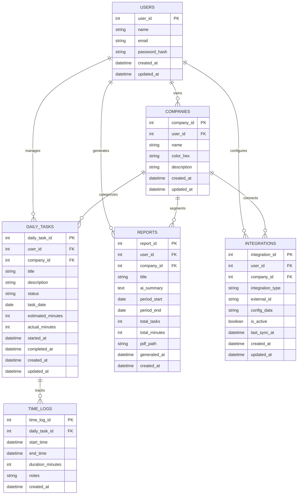

# Especificações do Projeto

### Definição do Problema

Desenvolvedores que gerenciam múltiplos projetos enfrentam dificuldades para organizar tarefas diárias, manter visibilidade do que deve ser executado, gerar relatórios profissionais para clientes e gerenciar eficientemente tarefas recorrentes versus pontuais. A falta de uma ferramenta unificada resulta em perda de produtividade, dificuldade na prestação de contas e gestão fragmentada entre diferentes clientes.

### Solução Proposta

Sistema web híbrido kanban/diário com IA integrada que oferece organização temporal de tarefas, geração automática de relatórios profissionais e gestão inteligente de recorrências. A solução centraliza a gestão diária em uma interface visual intuitiva, automatiza processos repetitivos e fornece insights de produtividade.

---

## Usuário do Sistema

| **Tipo de Usuário**          | **Descrição**                                                       | **Responsabilidades**                                                                                                                                                              |
| ---------------------------- | ------------------------------------------------------------------- | ---------------------------------------------------------------------------------------------------------------------------------------------------------------------------------- |
| **Desenvolvedor Freelancer** | Profissional autônomo que atende múltiplos clientes simultaneamente | Organizar tarefas diárias por cliente, controlar tempo trabalhado, gerar relatórios para prestação de contas, configurar tarefas recorrentes, acompanhar métricas de produtividade |

---

## Arquitetura e Tecnologias

A arquitetura adotada é baseada em uma **abordagem em camadas (Layered Architecture)**, projetada para ser modular e escalável, dividindo as responsabilidades entre as trilhas de Frontend e Backend.

### Stack de Referência (Restrição 04)

- **Frontend:** React (para web app responsivo).
- **Backend:** Node.js/NestJS (para lógica de negócio e APIs RESTful).
- **Banco de Dados:** SQL (utilizando Prisma como ORM/Client).
- **Inteligência Artificial:** Integração via API externa (Gemini API) para geração de resumos.

### Camadas da Solução

- **Apresentação (Frontend):** Responsável pela interface do usuário e responsividade (RNF-001). Implementa o Kanban, Dashboard e as telas de relatórios.
- **Serviço/Aplicação (Backend - NestJS):** Contém a lógica de negócio, autenticação (RF-001), segurança (RNF-005) e orquestra a comunicação com o Banco de Dados e a API de IA.
- **Dados (SQL + Prisma):** Armazena informações de usuários, tarefas e relatórios. Garante a integridade e normalização dos dados (RNF-004).
- **IA Externa:** Serviço separado para processar e gerar resumos profissionais (RF-005).

# Project Model Canvas – Companion

### Justificativa

Empresas têm dificuldade em organizar tarefas e gerar relatórios.  
Isso causa perda de produtividade e falhas na prestação de contas.

### Objetivos

- Criar um sistema híbrido (Kanban + Diário) com IA
- Reduzir tempo de planejamento e aumentar execução
- Melhorar clareza e produtividade

### Benefícios

- Organização simples e prática
- Relatórios rápidos e profissionais
- Mais controle do tempo gasto


## Requisitos

**Técnica de priorização adotada: MoSCoW**

- **Must (ALTA)**: imprescindível ao MVP e diretamente ligado aos critérios de sucesso (kanban Futuro|Hoje|Passado; recorrentes; resumos IA; relatórios por empresa; timer/horas).
- **Should (MÉDIA)**: eleva valor e usabilidade (templates de relatório; filtros/identidade visual por label).
- **Could (BAIXA)**: diferencia, mas não bloqueia MVP (integrações externas, métricas avançadas).

### Requisitos Funcionais

| ID     | Descrição do Requisito                                                                                                                                                                                     | Prioridade | Status                | Responsável Principal      |
| ------ | ---------------------------------------------------------------------------------------------------------------------------------------------------------------------------------------------------------- | ---------- | --------------------- | -------------------------- |
| RF-001 | Autenticação/Autorização com papéis (Proprietário, Admin, Colaborador, Cliente).                                                                                                                           | ALTA       | Concluído             | Aaron Carvalho Balbino     |
| RF-002 | Gestão Completa de Projetos/Labels: Capacidade de Cadastrar, Visualizar, Editar e Excluir informações de Projetos e Labels, incluindo a identidade visual/cores\* específicas de cada uma.                 | ALTA       | Concluído             | William da Silva Rodrigues |
| RF-003 | Gestão Completa de Tarefas Diárias: Capacidade de Criar, Consultar, Modificar e Deletar Tarefas Diárias, armazenando os detalhes como título, projeto associado, estimativa de tempo e descrição completa. | ALTA       | Pivotado pelo Cliente | Enzo Gomes Azevedo         |
| RF-004 | Kanban com colunas A Fazer \| Revisão \| Em Progresso \| Concluído e suporte a drag-and-drop.                                                                                                              | ALTA       | Concluído             | Adriana Pereira Nascimento |
| RF-005 | Assistente IA: gerar resumos profissionais das tarefas concluídas no período.                                                                                                                              | ALTA       | Concluído             | William da Silva Rodrigues |
| RF-006 | Geração de relatórios por projeto /label (período selecionável).                                                                                                                                           | ALTA       | Concluído             | Aaron Carvalho Balbino     |
| RF-007 | Exportação em PDF dos relatórios com layout profissional.                                                                                                                                                  | ALTA       | Concluído             | Adriana Pereira Nascimento |
| RF-008 | Filtros/visões por projeto /label e por status.                                                                                                                                                            | MÉDIA      | Concluído             | Enzo Gomes Azevedo         |
| RF-009 | Dashboard de métricas: tempo por projeto /tipo de tarefa, histórico semanal/mensal.                                                                                                                        | MÉDIA      | Concluído             | William da Silva Rodrigues |
| RF-010 | Histórico/auditoria de alterações de tarefa e tempo.                                                                                                                                                       | MÉDIA      | Concluído             | Aaron Carvalho Balbino     |
| RF-011 | Compartilhamento seguro de relatórios (Baixar o PDF).                                                                                                                                                      | BAIXA      | Concluído             | Enzo Gomes Azevedo         |

### Requisitos não Funcionais

| ID      | Descrição do Requisito                                                      | Prioridade |
| ------- | --------------------------------------------------------------------------- | ---------- |
| RNF-001 | Responsivo (desktop prioritário; uso confortável no mobile).                | ALTA       |
| RNF-002 | Desempenho: carregar dashboard em <3s; operações CRUD <1s.                  | ALTA       |
| RNF-003 | Relatórios gerados em <10s; processamento de IA <15s.                       | ALTA       |
| RNF-004 | APIs RESTful; banco normalizado com relacionamentos corretos.               | ALTA       |
| RNF-005 | Segurança: autenticação, RBAC, proteção a injeção/CSRF/XSS, logs.           | ALTA       |
| RNF-006 | Privacidade: relatórios segmentados por empresa; compartilhamento restrito. | ALTA       |
| RNF-007 | Auditoria: timestamps e trilhas de alterações de tempo/tarefa.              | MÉDIA      |
| RNF-008 | Exportação de dados (PDF) garantida para portabilidade.                     | MÉDIA      |
| RNF-009 | Observabilidade: métricas e logs mínimos para diagnósticos.                 | MÉDIA      |
| RNF-010 | Acessibilidade: contraste/teclado/aria nas telas principais.                | MÉDIA      |
| RNF-011 | Compatibilidade: Chrome/Firefox/Edge recentes.                              | BAIXA      |

## Restrições

O projeto está restrito pelos itens apresentados na tabela a seguir.

| ID  | Restrição                                                                                                                                                                               |
| --- | --------------------------------------------------------------------------------------------------------------------------------------------------------------------------------------- |
| 01  | Prazo acadêmico: entregar MVP funcional até o fim do semestre.                                                                                                                          |
| 02  | Escopo do MVP focado em: kanban temporal, recorrentes, timer, IA de resumos e relatório PDF por empresa. Integrações externas (GitHub/Trello/deploy) são Could (não bloqueiam entrega). |
| 03  | Time de 6 pessoas, sem terceirização. Divisão por trilhas acima.                                                                                                                        |
| 04  | Stack de referência (para manter consistência entre entregas): Frontend React; Backend Node.js/NestJS; SQL + Prisma; API de IA externa com prompt interno fixo.                         |
| 05  | Custo zero/low-cost: uso de tiers gratuitos e serviços gerenciados mínimos; sem dados sensíveis de produção.                                                                            |

## Diagrama de Caso de Uso


## Arquitetura da Solução

A seguir, descreve-se a estrutura do software, detalhando os componentes que formam a solução e o ambiente onde a aplicação será hospedada.

A arquitetura adotada é baseada em uma plataforma em nuvem, que integra múltiplas camadas para suportar aplicações tanto para web quanto para dispositivos móveis. Essa arquitetura é modular e escalável, sendo projetada para ambientes distribuídos. Ela divide as responsabilidades entre as diversas camadas e se aproveita de serviços gerenciados para garantir alta disponibilidade, segurança robusta e facilidade de manutenção.

Em termos gerais, a arquitetura é organizada nas seguintes camadas:

- _Frontend/Clientes:_ A camada responsável pela interação com o usuário, acessada por meio de navegadores ou aplicativos móveis.

- _Backend:_ Onde ocorrem o processamento das lógicas de negócio, a gestão dos dados e a integração com sistemas externos.

- _Banco de Dados (SQL):_ Armazena os dados estruturados da aplicação, assegurando integridade e alta performance nas consultas realizadas.


## Modelo da Base de Dados

# Para banco de dados relacional:

# Sistema de Gestão Diária para Desenvolvedores

## Documentação da Base de Dados

---

## 1. Modelo Entidade-Relacionamento (MER)



---

## 2. Projeto Físico da Base de Dados

### 2.1 Tabela USERS

```sql
CREATE TABLE users (
    user_id INTEGER PRIMARY KEY AUTOINCREMENT,
    name VARCHAR(255) NOT NULL,
    email VARCHAR(320) UNIQUE NOT NULL,
    password_hash VARCHAR(255) NOT NULL,
    created_at TIMESTAMP DEFAULT CURRENT_TIMESTAMP,
    updated_at TIMESTAMP DEFAULT CURRENT_TIMESTAMP
);

CREATE INDEX idx_users_email ON users(email);
```

**Descrição:** Armazena informações dos desenvolvedores que utilizam o sistema.

**Campos:**

- `user_id`: Chave primária, identificador único do usuário
- `name`: Nome completo do usuário
- `email`: Email único para autenticação
- `password_hash`: Hash da senha para segurança
- `created_at`: Data de criação do registro
- `updated_at`: Data da última atualização

### 2.2 Tabela COMPANIES

```sql
CREATE TABLE companies (
    company_id INTEGER PRIMARY KEY AUTOINCREMENT,
    user_id INTEGER NOT NULL,
    name VARCHAR(255) NOT NULL,
    color_hex VARCHAR(7) NOT NULL DEFAULT '#3498db',
    description TEXT,
    created_at TIMESTAMP DEFAULT CURRENT_TIMESTAMP,
    updated_at TIMESTAMP DEFAULT CURRENT_TIMESTAMP,
    FOREIGN KEY (user_id) REFERENCES users(user_id) ON DELETE CASCADE
);

CREATE INDEX idx_companies_user_id ON companies(user_id);
```

**Descrição:** Empresas/clientes dos desenvolvedores com identidade visual.

**Campos:**

- `company_id`: Chave primária, identificador único da empresa
- `user_id`: Chave estrangeira para users
- `name`: Nome da empresa/cliente
- `color_hex`: Cor em hexadecimal para labels visuais
- `description`: Descrição opcional da empresa
- `created_at`: Data de criação
- `updated_at`: Data da última atualização

### 2.4 Tabela DAILY_TASKS

```sql
CREATE TABLE daily_tasks (
    daily_task_id INTEGER PRIMARY KEY AUTOINCREMENT,
    user_id INTEGER NOT NULL,
    company_id INTEGER,
    title VARCHAR(255) NOT NULL,
    description TEXT,
    status ENUM('future', 'today', 'in_progress', 'completed', 'past') DEFAULT 'future',
    task_date DATE NOT NULL,
    estimated_minutes INTEGER DEFAULT 30,
    actual_minutes INTEGER DEFAULT 0,
    started_at TIMESTAMP,
    completed_at TIMESTAMP,
    created_at TIMESTAMP DEFAULT CURRENT_TIMESTAMP,
    updated_at TIMESTAMP DEFAULT CURRENT_TIMESTAMP,
    FOREIGN KEY (user_id) REFERENCES users(user_id) ON DELETE CASCADE,
    FOREIGN KEY (company_id) REFERENCES companies(company_id) ON DELETE SET NULL,
);

CREATE INDEX idx_daily_tasks_user_id ON daily_tasks(user_id);
CREATE INDEX idx_daily_tasks_company_id ON daily_tasks(company_id);
CREATE INDEX idx_daily_tasks_task_date ON daily_tasks(task_date);
CREATE INDEX idx_daily_tasks_status ON daily_tasks(status);
```

**Descrição:** Tarefas específicas organizadas no kanban temporal (Futuro | Hoje | Passado).

**Campos:**

- `daily_task_id`: Chave primária
- `user_id`: Chave estrangeira para users
- `company_id`: Chave estrangeira para companies
- `title`: Título da tarefa
- `description`: Descrição detalhada
- `status`: Status atual (future, today, in_progress, completed, past)
- `task_date`: Data da tarefa
- `estimated_minutes`: Tempo estimado em minutos
- `actual_minutes`: Tempo real gasto em minutos
- `started_at`: Timestamp de início da tarefa
- `completed_at`: Timestamp de conclusão
- `created_at`: Data de criação
- `updated_at`: Data da última atualização

### 2.5 Tabela REPORTS

```sql
CREATE TABLE reports (
    report_id INTEGER PRIMARY KEY AUTOINCREMENT,
    user_id INTEGER NOT NULL,
    company_id INTEGER,
    title VARCHAR(255) NOT NULL,
    ai_summary TEXT,
    period_start DATE NOT NULL,
    period_end DATE NOT NULL,
    total_tasks INTEGER DEFAULT 0,
    total_minutes INTEGER DEFAULT 0,
    pdf_path VARCHAR(500),
    generated_at TIMESTAMP DEFAULT CURRENT_TIMESTAMP,
    created_at TIMESTAMP DEFAULT CURRENT_TIMESTAMP,
    FOREIGN KEY (user_id) REFERENCES users(user_id) ON DELETE CASCADE,
    FOREIGN KEY (company_id) REFERENCES companies(company_id) ON DELETE CASCADE
);

CREATE INDEX idx_reports_user_id ON reports(user_id);
CREATE INDEX idx_reports_company_id ON reports(company_id);
CREATE INDEX idx_reports_period ON reports(period_start, period_end);
```

**Descrição:** Relatórios gerados automaticamente com resumos da IA por período e empresa.

**Campos:**

- `report_id`: Chave primária
- `user_id`: Chave estrangeira para users
- `company_id`: Chave estrangeira para companies (filtro por empresa)
- `title`: Título do relatório
- `ai_summary`: Resumo gerado pela IA das atividades
- `period_start`: Data de início do período
- `period_end`: Data de fim do período
- `total_tasks`: Total de tarefas no período
- `total_minutes`: Total de minutos trabalhados
- `pdf_path`: Caminho para o arquivo PDF exportado
- `generated_at`: Timestamp de geração do relatório
- `created_at`: Data de criação

### 2.6 Tabela TIME_LOGS

```sql
CREATE TABLE time_logs (
    time_log_id INTEGER PRIMARY KEY AUTOINCREMENT,
    daily_task_id INTEGER NOT NULL,
    start_time TIMESTAMP NOT NULL,
    end_time TIMESTAMP,
    duration_minutes INTEGER,
    notes TEXT,
    created_at TIMESTAMP DEFAULT CURRENT_TIMESTAMP,
    FOREIGN KEY (daily_task_id) REFERENCES daily_tasks(daily_task_id) ON DELETE CASCADE
);

CREATE INDEX idx_time_logs_daily_task_id ON time_logs(daily_task_id);
CREATE INDEX idx_time_logs_start_time ON time_logs(start_time);
```

**Descrição:** Registros detalhados de tempo por tarefa com timer integrado.

**Campos:**

- `time_log_id`: Chave primária
- `daily_task_id`: Chave estrangeira para daily_tasks
- `start_time`: Timestamp de início do timer
- `end_time`: Timestamp de fim do timer
- `duration_minutes`: Duração calculada em minutos
- `notes`: Notas adicionais sobre o período trabalhado
- `created_at`: Data de criação

### 2.7 Tabela INTEGRATIONS

```sql
CREATE TABLE integrations (
    integration_id INTEGER PRIMARY KEY AUTOINCREMENT,
    user_id INTEGER NOT NULL,
    company_id INTEGER,
    integration_type ENUM('github', 'trello', 'render', 'netlify') NOT NULL,
    external_id VARCHAR(255),
    config_data JSON,
    is_active BOOLEAN DEFAULT TRUE,
    last_sync_at TIMESTAMP,
    created_at TIMESTAMP DEFAULT CURRENT_TIMESTAMP,
    updated_at TIMESTAMP DEFAULT CURRENT_TIMESTAMP,
    FOREIGN KEY (user_id) REFERENCES users(user_id) ON DELETE CASCADE,
    FOREIGN KEY (company_id) REFERENCES companies(company_id) ON DELETE SET NULL
);

CREATE INDEX idx_integrations_user_id ON integrations(user_id);
CREATE INDEX idx_integrations_company_id ON integrations(company_id);
CREATE INDEX idx_integrations_type ON integrations(integration_type);
```

**Descrição:** Configurações de integrações externas (GitHub, Trello, Deploy platforms).

**Campos:**

- `integration_id`: Chave primária
- `user_id`: Chave estrangeira para users
- `company_id`: Chave estrangeira para companies (opcional)
- `integration_type`: Tipo de integração (github, trello, render, netlify)
- `external_id`: ID externo da integração
- `config_data`: Configurações em JSON (tokens, webhooks, etc.)
- `is_active`: Flag para ativar/desativar integração
- `last_sync_at`: Timestamp da última sincronização
- `created_at`: Data de criação
- `updated_at`: Data da última atualização

---

## 3. Relacionamentos e Integridade Referencial

### 3.1 Relacionamentos Principais

- **users → companies**: Um usuário pode ter várias empresas (1:N)
- **users → daily_tasks**: Um usuário pode ter várias tarefas diárias (1:N)
- **companies → daily_tasks**: Uma empresa pode ter várias tarefas diárias (1:N)
- **daily_tasks → time_logs**: Uma tarefa diária pode ter vários logs de tempo (1:N)

### 3.2 Constraints de Integridade

- **CASCADE**: Exclusão de usuário remove todas as suas empresas, tarefas e relatórios
- **SET NULL**: Exclusão de empresa mantém tarefas mas remove a referência
- **UNIQUE**: Email do usuário deve ser único no sistema
- **NOT NULL**: Campos obrigatórios para funcionamento do sistema

---

## 4. Índices para Performance

### 4.1 Índices de Busca Frequente

- `idx_users_email`: Busca rápida por email na autenticação
- `idx_daily_tasks_task_date`: Filtros por data no kanban
- `idx_daily_tasks_status`: Filtros por status (Futuro, Hoje, Passado)

### 4.2 Índices de Relacionamento

- `idx_companies_user_id`: Busca empresas por usuário
- `idx_daily_tasks_company_id`: Filtros por empresa nos relatórios
- `idx_time_logs_daily_task_id`: Cálculo de tempo por tarefa

---

## 5. Considerações Técnicas

### 5.1 Migração Automática às 00h

- Job scheduler atualiza `status` de 'today' para 'past' em `daily_tasks`
- Trigger automático para popular tarefas recorrentes em 'today'

### 5.2 Cálculo de Métricas

- Views materializadas para dashboard de produtividade
- Agregações de tempo por empresa e tipo de tarefa
- Histórico de produtividade semanal/mensal

### 5.3 Backup e Auditoria

- Campos `created_at` e `updated_at` em todas as tabelas
- Soft delete opcional via campo `deleted_at`
- Logs de alterações para auditoria completa
