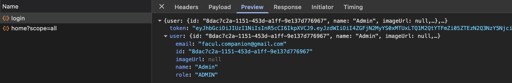
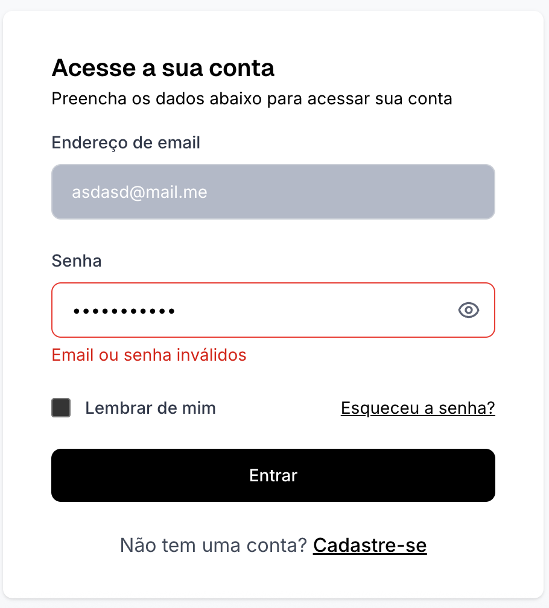
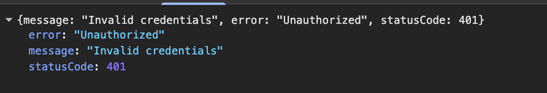
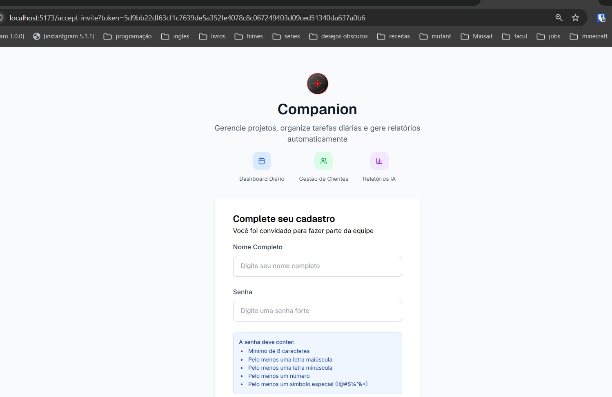
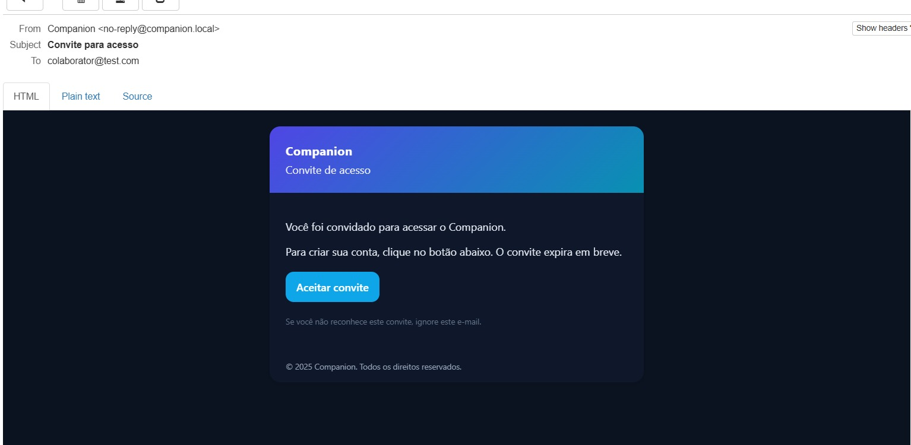

# RF-001

## Autenticação/Autorização com papéis (Proprietário, Admin, Colaborador, Cliente)

<table>
  <tr>
    <th colspan="6" width="1000">CT-RF-00101 Login com credenciais válidas</th>
  </tr>
  <tr>
    <td width="170"><strong>Critérios de êxito</strong></td>
    <td colspan="5">O sistema deve autenticar o usuário ao informar email e senha válidos, retornando um token JWT e redirecionando para o dashboard.</td>
  </tr>
  <tr>
    <td><strong>Responsável pela funcionalidade (desenvolvimento e teste)</strong></td>
    <td width="430">Desenvolvimento: Aaron Carvalho Balbino Teste: Enzo Gomes Azevedo</td>
    <td width="100"><strong>Data do Teste</strong></td>
    <td width="150">05/11/2025</td>
  </tr>
  <tr>
    <td width="170"><strong>Comentário</strong></td>
    <td colspan="5">Funcionalidade implementada corretamente. O sistema valida as credenciais usando bcrypt, gera token JWT incluindo o papel do usuário (role), e retorna dados do usuário autenticado. A interface redireciona automaticamente para o dashboard após login bem-sucedido.</td>
  </tr>
  <tr>
    <td colspan="6" align="center"><strong>Evidência</strong></td>
  </tr>
  <tr>
    <td colspan="6" align="center"></td>
  </tr>
</table>

 

<table>
  <tr>
    <th colspan="6" width="1000">CT-RF-00102 Login com credenciais inválidas</th>
  </tr>
  <tr>
    <td width="170"><strong>Critérios de êxito</strong></td>
    <td colspan="5">O sistema deve rejeitar login ao informar email ou senha incorretos, exibindo mensagem "Email ou senha inválidos" sem revelar qual campo está incorreto.</td>
  </tr>
  <tr>
    <td><strong>Responsável pela funcionalidade (desenvolvimento e teste)</strong></td>
    <td width="430">Desenvolvimento: Aaron Carvalho Balbino Teste: Enzo Gomes Azevedo</td>
    <td width="100"><strong>Data do Teste</strong></td>
    <td width="150">05/11/2025</td>
  </tr>
  <tr>
    <td width="170"><strong>Comentário</strong></td>
    <td colspan="5">Funcionalidade implementada corretamente. O sistema retorna status 401 Unauthorized e mensagem genérica de segurança sem identificar se email ou senha está incorreto. Após 5 tentativas falhas, o frontend implementa rate limiting bloqueando novas tentativas por 15 minutos.</td>
  </tr>
  <tr>
    <td colspan="6" align="center"><strong>Evidência</strong></td>
  </tr>
  <tr>
    <td colspan="6" align="center"></td>
  </tr>
</table>

 

<table>
  <tr>
    <th colspan="6" width="1000">CT-RF-00103 Autorização baseada em papéis (RBAC)</th>
  </tr>
  <tr>
    <td width="170"><strong>Critérios de êxito</strong></td>
    <td colspan="5">O sistema deve permitir acesso a endpoints protegidos apenas para usuários com papéis autorizados (OWNER, ADMIN, COLLABORATOR, CLIENT), bloqueando acessos não autorizados com status 403 Forbidden.</td>
  </tr>
  <tr>
    <td><strong>Responsável pela funcionalidade (desenvolvimento e teste)</strong></td>
    <td width="430">Desenvolvimento: Aaron Carvalho Balbino Teste: Enzo Gomes Azevedo</td>
    <td width="100"><strong>Data do Teste</strong></td>
    <td width="150">05/11/2025</td>
  </tr>
  <tr>
    <td width="170"><strong>Comentário</strong></td>
    <td colspan="5">Funcionalidade implementada corretamente. O sistema utiliza RolesGuard para validar permissões baseadas no papel armazenado no token JWT. Endpoints como GET /users requerem Role.ADMIN, enquanto PATCH /users/profile aceita Role.ADMIN ou Role.COLLABORATOR. O guard verifica se o papel do usuário está na lista de papéis permitidos antes de permitir acesso.</td>
  </tr>
  <tr>
    <td colspan="6" align="center"><strong>Evidência</strong></td>
  </tr>
  <tr>
    <td colspan="6" align="center"></td>
  </tr>
</table>

 

<table>
  <tr>
    <th colspan="6" width="1000">CT-RF-00104 Aceitar convite e criar conta com papel atribuído</th>
  </tr>
  <tr>
    <td width="170"><strong>Critérios de êxito</strong></td>
    <td colspan="5">O sistema deve permitir que um usuário convidado aceite o convite fornecendo nome e senha válidos, criando uma conta com o papel (role) previamente definido no convite.</td>
  </tr>
  <tr>
    <td><strong>Responsável pela funcionalidade (desenvolvimento e teste)</strong></td>
    <td width="430">Desenvolvimento: Aaron Carvalho Balbino Teste: Enzo Gomes Azevedo</td>
    <td width="100"><strong>Data do Teste</strong></td>
    <td width="150">05/11/2025</td>
  </tr>
  <tr>
    <td width="170"><strong>Comentário</strong></td>
    <td colspan="5">Funcionalidade implementada corretamente. O sistema valida o token do convite (hash SHA256), verifica se não foi aceito/revogado/expirado, cria usuário com o papel definido no convite, e marca o convite como aceito. A interface valida senha forte (8+ caracteres, maiúscula, minúscula, número, símbolo especial) antes de enviar.</td>
  </tr>
  <tr>
    <td colspan="6" align="center"><strong>Evidência</strong></td>
  </tr>
  <tr>
    <td colspan="6" align="center"></td>
  </tr>
</table>

 

<table>
  <tr>
    <th colspan="6" width="1000">CT-RF-00105 Recuperação de senha com token seguro</th>
  </tr>
  <tr>
    <td width="170"><strong>Critérios de êxito</strong></td>
    <td colspan="5">O sistema deve enviar email com link de recuperação ao solicitar reset de senha, validar token único de 32 bytes (hash SHA256), e permitir redefinição de senha apenas se token válido e não expirado.</td>
  </tr>
  <tr>
    <td><strong>Responsável pela funcionalidade (desenvolvimento e teste)</strong></td>
    <td width="430">Desenvolvimento: Aaron Carvalho Balbino Teste: Enzo Gomes Azevedo</td>
    <td width="100"><strong>Data do Teste</strong></td>
    <td width="150">05/11/2025</td>
  </tr>
  <tr>
    <td width="170"><strong>Comentário</strong></td>
    <td colspan="5">Funcionalidade implementada corretamente. O sistema gera token aleatório criptograficamente seguro (randomBytes), armazena hash SHA256 com expiração configurável (RESET_EXP_MINUTES), envia email via MailerService, e invalida tokens anteriores do mesmo usuário. Ao resetar, valida expiração e marca token como consumido em transação atômica.</td>
  </tr>
  <tr>
    <td colspan="6" align="center"><strong>Evidência</strong></td>
  </tr>
  <tr>
    <td colspan="6" align="center"></td>
  </tr>
</table>

---

## Observações Técnicas

**Endpoints testados:**

- `POST /auth/login` - Autenticação com email/senha
- `POST /auth/accept-invite` - Aceitar convite e criar conta
- `POST /auth/forgot-password` - Solicitar recuperação de senha
- `POST /auth/reset-password` - Redefinir senha com token
- `GET /auth/me` - Obter perfil do usuário autenticado
- `GET /auth/google` - OAuth2 Google (implementado mas não testado)
- `GET /auth/google/callback` - Callback OAuth2 Google

**Componentes testados:**

- `AuthController` ([auth.controller.ts:26-124](codigo-fonte/backend/src/auth/auth.controller.ts:26-124)) - Endpoints de autenticação
- `AuthService` ([auth.service.ts:18-179](codigo-fonte/backend/src/auth/auth.service.ts:18-179)) - Lógica de autenticação e autorização
- `RolesGuard` ([roles.guard.ts:8-22](codigo-fonte/backend/src/common/guards/roles.guard.ts:8-22)) - Validação RBAC
- `JwtStrategy` ([jwt.strategy.ts](codigo-fonte/backend/src/auth/strategies/jwt.strategy.ts)) - Validação de tokens JWT
- `LoginForm` ([LoginForm.jsx:10-158](codigo-fonte/frontend/src/components/forms/LoginForm.jsx:10-158)) - Formulário de login frontend
- `AcceptInvitePage` ([AcceptInvitePage.jsx:16-252](codigo-fonte/frontend/src/pages/auth/AcceptInvitePage.jsx:16-252)) - Página de aceitar convite

**Validações:**

- Email obrigatório e formato válido
- Senha mínimo 8 caracteres no login
- Senha forte no aceite de convite (maiúscula, minúscula, número, símbolo)
- Token JWT assinado e validado em cada requisição protegida
- Rate limiting: máximo 5 tentativas de login em 15 minutos
- Tokens de reset/convite: validação de expiração e consumo único
- Hash bcrypt para senhas (salt rounds = 10)
- Hash SHA256 para tokens de reset/convite

**Regras de negócio:**

- Papéis disponíveis: OWNER, ADMIN, COLLABORATOR, CLIENT (enum em [role.enum.ts:1-6](codigo-fonte/backend/src/common/enums/role.enum.ts:1-6))
- RolesGuard verifica se papel do usuário está na lista de papéis permitidos
- Token JWT inclui: sub (userId), email, role
- Convites invalidam convites anteriores do mesmo email
- Reset de senha invalida tokens anteriores do mesmo usuário
- Usuário criado via convite pode requerer aprovação admin (configurável via REQUIRE_ADMIN_APPROVAL)
- AuthGuard('jwt') + RolesGuard protegem endpoints sensíveis
- Mensagens de erro genéricas para segurança (não revelam se email existe)
