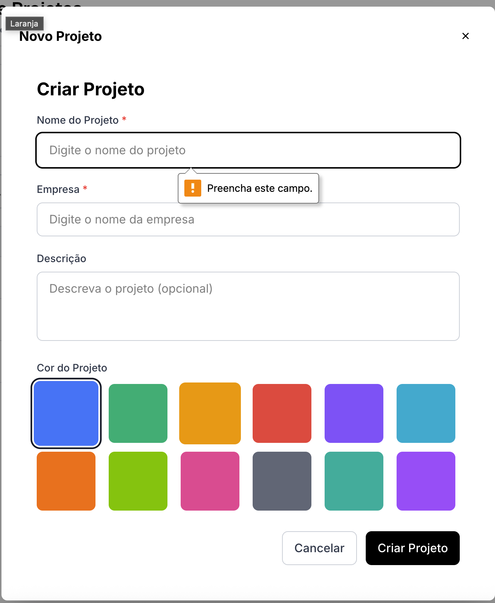
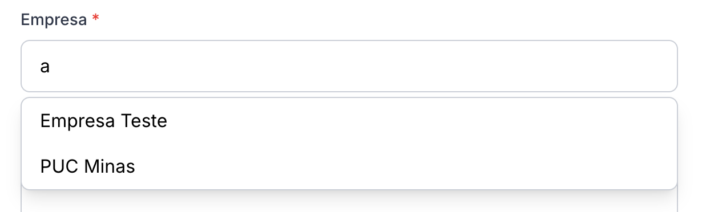
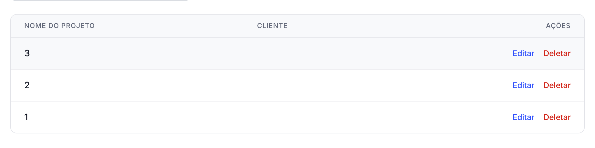
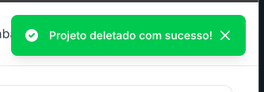

# RF-002

## Gestão Completa de Projetos/Labels: Capacidade de Cadastrar, Visualizar, Editar e Excluir informações de Projetos e Labels, incluindo a identidade visual/cores específicas de cada uma

<table>
  <tr>
    <th colspan="6" width="1000">CT-RF-00201 Criar projeto com nome, descrição e cor</th>
  </tr>
  <tr>
    <td width="170"><strong>Critérios de êxito</strong></td>
    <td colspan="5">O sistema deve permitir a criação de um novo projeto informando nome obrigatório, descrição opcional e cor em formato hexadecimal, associando automaticamente ao usuário criador.</td>
  </tr>
  <tr>
    <td><strong>Responsável pela funcionalidade (desenvolvimento e teste)</strong></td>
    <td width="430">Desenvolvimento: William da Silva Rodrigues Teste: Enzo Gomes Azevedo</td>
    <td width="100"><strong>Data do Teste</strong></td>
    <td width="150">09/11/2025</td>
  </tr>
  <tr>
    <td width="170"><strong>Comentário</strong></td>
    <td colspan="5">Funcionalidade implementada corretamente. O sistema valida campos obrigatórios (nome), aceita descrição opcional, valida formato hexadecimal da cor (#RRGGBB) usando decorator @IsHexColor, e armazena createdById automaticamente via JWT. A interface oferece 12 cores predefinidas (#3B82F6, #10B981, #F59E0B, etc.) para seleção visual. O formulário requer Role.ADMIN para acesso.</td>
  </tr>
  <tr>
    <td colspan="6" align="center"><strong>Evidência</strong></td>
  </tr>
  <tr>
    <td colspan="6" align="center"></td>
  </tr>
</table>

 

<table>
  <tr>
    <th colspan="6" width="1000">CT-RF-00202 Criar projeto associado a empresa existente ou nova</th>
  </tr>
  <tr>
    <td width="170"><strong>Critérios de êxito</strong></td>
    <td colspan="5">O sistema deve permitir criar projeto vinculado a uma empresa existente (via companyId) ou criar nova empresa automaticamente (via clientName), validando que ao menos uma das opções seja fornecida.</td>
  </tr>
  <tr>
    <td><strong>Responsável pela funcionalidade (desenvolvimento e teste)</strong></td>
    <td width="430">Desenvolvimento: William da Silva Rodrigues Teste: Enzo Gomes Azevedo</td>
    <td width="100"><strong>Data do Teste</strong></td>
    <td width="150">09/11/2025</td>
  </tr>
  <tr>
    <td width="170"><strong>Comentário</strong></td>
    <td colspan="5">Funcionalidade implementada corretamente. O método ensureCompanyId verifica se companyId existe, caso contrário busca empresa por clientName. Se não encontrar, cria nova empresa automaticamente com o usuário como owner. Se nenhum dos campos for fornecido, retorna BadRequestException com mensagem clara. A interface oferece CompanySelect para escolher empresa existente ou digitar nome de nova empresa.</td>
  </tr>
  <tr>
    <td colspan="6" align="center"><strong>Evidência</strong></td>
  </tr>
  <tr>
    <td colspan="6" align="center"></td>
  </tr>
</table>

 

<table>
  <tr>
    <th colspan="6" width="1000">CT-RF-00203 Visualizar lista de projetos com filtro por empresa</th>
  </tr>
  <tr>
    <td width="170"><strong>Critérios de êxito</strong></td>
    <td colspan="5">O sistema deve exibir lista de projetos ordenados por data de criação (mais recentes primeiro), incluindo informações da empresa associada, contagem de tarefas, e permitir filtro opcional por companyId.</td>
  </tr>
  <tr>
    <td><strong>Responsável pela funcionalidade (desenvolvimento e teste)</strong></td>
    <td width="430">Desenvolvimento: William da Silva Rodrigues Teste: Enzo Gomes Azevedo</td>
    <td width="100"><strong>Data do Teste</strong></td>
    <td width="150">09/11/2025</td>
  </tr>
  <tr>
    <td width="170"><strong>Comentário</strong></td>
    <td colspan="5">Funcionalidade implementada corretamente. O endpoint GET /projects aceita query param ?companyId=uuid para filtro, retorna array ordenado por createdAt desc, inclui company.name e _count.tasks via Prisma include. A interface ProjectsPage exibe tabela com nome, descrição, cliente e ações (editar/deletar). Métricas agregadas mostram total de projetos, clientes únicos, tarefas e horas trabalhadas.</td>
  </tr>
  <tr>
    <td colspan="6" align="center"><strong>Evidência</strong></td>
  </tr>
  <tr>
    <td colspan="6" align="center"></td>
  </tr>
</table>

 

<table>
  <tr>
    <th colspan="6" width="1000">CT-RF-00204 Editar projeto existente</th>
  </tr>
  <tr>
    <td width="170"><strong>Critérios de êxito</strong></td>
    <td colspan="5">O sistema deve permitir atualização de nome, descrição e cor de um projeto existente via PATCH /projects/:id, validando formato hexadecimal da cor e mantendo integridade dos dados.</td>
  </tr>
  <tr>
    <td><strong>Responsável pela funcionalidade (desenvolvimento e teste)</strong></td>
    <td width="430">Desenvolvimento: William da Silva Rodrigues Teste: Enzo Gomes Azevedo</td>
    <td width="100"><strong>Data do Teste</strong></td>
    <td width="150">09/11/2025</td>
  </tr>
  <tr>
    <td width="170"><strong>Comentário</strong></td>
    <td colspan="5">Funcionalidade implementada corretamente. O UpdateProjectDto herda validações de CreateProjectDto via PartialType, permitindo atualização parcial de campos. O service usa prisma.project.update com where: {id} e data: dto. A interface pré-popula formulário com dados existentes quando openEditModal é chamado, exibindo botão "Salvar Alterações" ao invés de "Criar Projeto". Requer Role.ADMIN.</td>
  </tr>
  <tr>
    <td colspan="6" align="center"><strong>Evidência</strong></td>
  </tr>
  <tr>
    <td colspan="6" align="center"></td>
  </tr>
</table>

 

<table>
  <tr>
    <th colspan="6" width="1000">CT-RF-00205 Excluir projeto e gestão de empresas (CRUD completo)</th>
  </tr>
  <tr>
    <td width="170"><strong>Critérios de êxito</strong></td>
    <td colspan="5">O sistema deve permitir exclusão de projetos via DELETE /projects/:id com confirmação obrigatória na interface. Empresas devem suportar CRUD completo: criar (POST /companies), listar (GET /companies), visualizar (GET /companies/:id), editar (PATCH /companies/:id), excluir (DELETE /companies/:id), incluindo gestão de cores hexadecimais.</td>
  </tr>
  <tr>
    <td><strong>Responsável pela funcionalidade (desenvolvimento e teste)</strong></td>
    <td width="430">Desenvolvimento: William da Silva Rodrigues Teste: Enzo Gomes Azevedo</td>
    <td width="100"><strong>Data do Teste</strong></td>
    <td width="150">09/11/2025</td>
  </tr>
  <tr>
    <td width="170"><strong>Comentário</strong></td>
    <td colspan="5">Funcionalidade implementada corretamente. Projetos: DELETE /projects/:id usa prisma.project.delete, interface exibe modal de confirmação antes de chamar projectsService.delete. Empresas: CompaniesController implementa CRUD completo com validações (nome obrigatório @IsString, cor opcional @IsHexColor com default #3498db), CompaniesService gerencia membros via addMember e listMembers incluindo papéis. Ambos requerem Role.ADMIN, tratam erro 403 com mensagens específicas no frontend.</td>
  </tr>
  <tr>
    <td colspan="6" align="center"><strong>Evidência</strong></td>
  </tr>
  <tr>
    <td colspan="6" align="center"></td>
  </tr>
</table>

---

## Observações Técnicas

**Endpoints testados:**

- `POST /projects` - Criar projeto
- `GET /projects` - Listar todos os projetos com filtro opcional ?companyId=uuid
- `GET /projects/select` - Listar projetos simplificados (id, name, company, tasksCount)
- `GET /projects/:id` - Visualizar projeto específico com company e members
- `GET /projects/:id/tags` - Listar tags/labels do projeto com busca ?q=termo&take=20
- `PATCH /projects/:id` - Editar projeto
- `DELETE /projects/:id` - Excluir projeto
- `GET /projects/:id/metrics` - Métricas do projeto (totalTasks, doneTasks, totalHours, progress)
- `POST /companies` - Criar empresa
- `GET /companies` - Listar empresas
- `GET /companies/:id` - Visualizar empresa
- `PATCH /companies/:id` - Editar empresa
- `DELETE /companies/:id` - Excluir empresa
- `POST /companies/:id/members` - Adicionar membro à empresa
- `GET /companies/:id/members` - Listar membros da empresa

**Componentes testados:**

- `ProjectsController` ([projects.controller.ts:29-85](codigo-fonte/backend/src/projects/projects.controller.ts:29-85)) - Endpoints de projetos
- `ProjectsService` ([projects.service.ts:8-170](codigo-fonte/backend/src/projects/projects.service.ts:8-170)) - Lógica de projetos e tags
- `CompaniesController` ([companies.controller.ts:26-66](codigo-fonte/backend/src/companies/companies.controller.ts:26-66)) - Endpoints de empresas
- `CompaniesService` ([companies.service.ts:7-81](codigo-fonte/backend/src/companies/companies.service.ts:7-81)) - Lógica de empresas e membros
- `ProjectsPage` ([ProjectsPage.jsx:51-558](codigo-fonte/frontend/src/pages/ProjectsPage.jsx:51-558)) - Página de gerenciamento de projetos
- `ProjectForm` ([ProjectForm.jsx:20-162](codigo-fonte/frontend/src/components/projects/ProjectForm.jsx:20-162)) - Formulário de criação/edição

**Validações:**

- Nome do projeto obrigatório (@IsString)
- Cor em formato hexadecimal (#RRGGBB) validado com @IsHexColor
- CompanyId deve ser UUID válido (@IsUUID) ou clientName string
- Descrição opcional (@IsOptional @IsString)
- Ao menos companyId ou clientName deve ser fornecido (validação em ensureCompanyId)
- UpdateProjectDto permite atualização parcial (PartialType)
- Empresas: nome obrigatório, cor default #3498db se não fornecida

**Regras de negócio:**

- Projetos sempre vinculados a uma empresa (companyId obrigatório após processamento)
- Se clientName fornecido: busca empresa existente por nome exato, senão cria nova
- Nova empresa criada via clientName tem usuário atual como owner
- Projetos ordenados por createdAt desc (mais recentes primeiro)
- Tags/labels filtradas por projectId com busca case-insensitive (?q=termo)
- Métrica de progresso: (doneTasks / totalTasks) \* 100
- Apenas Role.ADMIN pode criar, editar ou excluir projetos e empresas
- Empresas incluem members com roles (OWNER, ADMIN, COLLABORATOR, CLIENT)
- Interface oferece 12 cores predefinidas para seleção visual
- Confirmação obrigatória antes de excluir projeto
- Frontend trata erro 403 com mensagem específica de permissão negada
