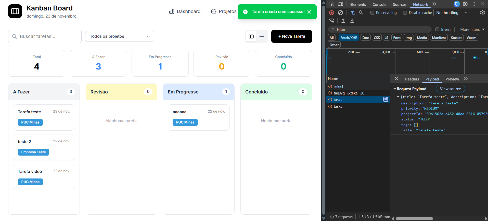
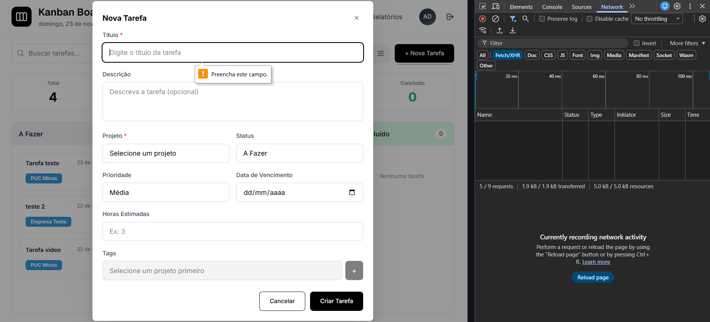
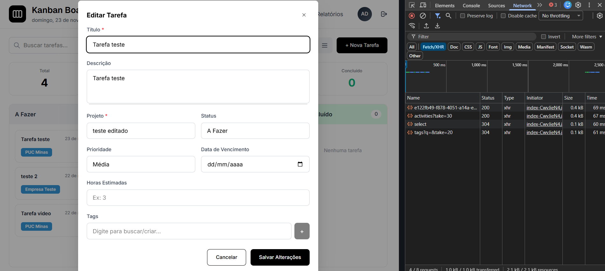
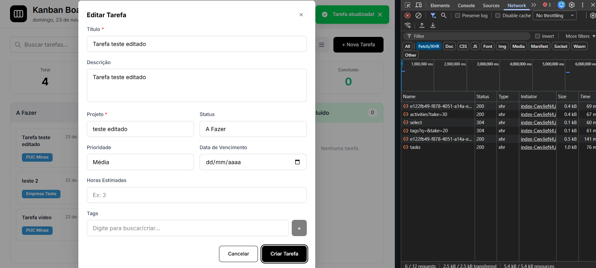
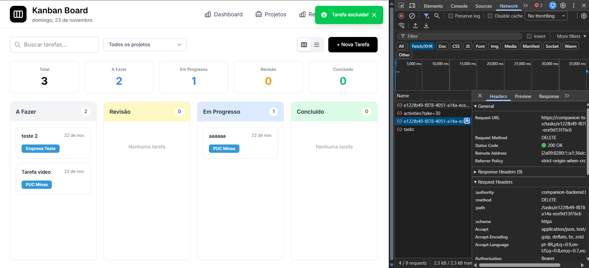

# RF-003

## Gestão Completa de Tarefas Diárias

<table>
  <tr>
    <th colspan="6" width="1000">CT-RF-00301 Criação de tarefa com campos obrigatórios (happy path)</th>
  </tr>
  <tr>
    <td width="170"><strong>Critérios de êxito</strong></td>
    <td colspan="5">
      Ao preencher título e projeto e enviar o formulário de criação de tarefa, a API
      <code>POST /tasks</code> deve ser chamada com os dados corretos. A tarefa criada deve aparecer na
      página de Kanban, com status padrão &quot;A Fazer&quot;, prioridade padrão &quot;Média&quot; e demais
      campos opcionais preenchidos quando informados. Uma notificação de sucesso (&quot;Tarefa criada
      com sucesso!&quot;) deve ser exibida.
    </td>
  </tr>
  <tr>
    <td><strong>Responsável pela funcionalidade (desenvolvimento e teste)</strong></td>
    <td width="430">
      Desenvolvimento: Enzo Gomes Azevedo 
      Teste: William da Silva Rodrigues
    </td>
    <td width="100"><strong>Data do Teste</strong></td>
    <td width="150">10/11/2025</td>
  </tr>
  <tr>
    <td width="170"><strong>Comentário</strong></td>
    <td colspan="5">
      Caso de teste focado na criação de tarefas pela <code>KanbanPage</code> usando o
      <code>TaskForm</code>. Espera-se que a chamada a <code>tasksService.create</code> ocorra com
      <code>title</code> e <code>projectId</code> obrigatórios e que a lista seja recarregada via
      <code>loadTasks</code>. Comentário deve ser atualizado após execução informando se a tarefa foi
      criada e exibida corretamente na coluna &quot;A Fazer&quot;.
    </td>
  </tr>
  <tr>
    <td colspan="6" align="center"><strong>Evidência</strong></td>
  </tr>
  <tr>
    <td colspan="6" align="center"></td>
  </tr>
</table>

 

<table>
  <tr>
    <th colspan="6" width="1000">CT-RF-00302 Validação de campos obrigatórios na criação de tarefa</th>
  </tr>
  <tr>
    <td width="170"><strong>Critérios de êxito</strong></td>
    <td colspan="5">
      Ao tentar enviar o formulário sem preencher o <strong>Título</strong> ou sem selecionar um
      <strong>Projeto</strong>, o navegador deve impedir o envio do formulário devido aos atributos
      <code>required</code> nos campos. Nenhuma requisição à API <code>POST /tasks</code> deve ser
      disparada e o usuário deve permanecer na tela de criação.
    </td>
  </tr>
  <tr>
    <td><strong>Responsável pela funcionalidade (desenvolvimento e teste)</strong></td>
    <td width="430">
      Desenvolvimento: Enzo Gomes Azevedo 
      Teste: William da Silva Rodrigues
    </td>
    <td width="100"><strong>Data do Teste</strong></td>
    <td width="150">10/11/2025</td>
  </tr>
  <tr>
    <td width="170"><strong>Comentário</strong></td>
    <td colspan="5">
      Teste focado nas validações HTML do <code>TaskForm</code> (campos <code>title</code> e
      <code>projectId</code> com <code>required</code>). Ao executar, registrar se o navegador exibiu
      mensagens padrões de campo obrigatório e se o botão de envio não chegou a disparar a ação
      <code>onSubmit</code>. Esperado: impedimento total de criação de tarefa sem esses campos.
    </td>
  </tr>
  <tr>
    <td colspan="6" align="center"><strong>Evidência</strong></td>
  </tr>
  <tr>
    <td colspan="6" align="center"></td>
  </tr>
</table>

 

<table>
  <tr>
    <th colspan="6" width="1000">CT-RF-00303 Edição de tarefa existente a partir do detalhe</th>
  </tr>
  <tr>
    <td width="170"><strong>Critérios de êxito</strong></td>
    <td colspan="5">
      Ao abrir o <strong>TaskDetailModal</strong> de uma tarefa existente e acionar a ação de
      &quot;Editar&quot;, o formulário deve ser carregado com os dados atuais. Após alterar campos como
      título, status, prioridade, data de vencimento, horas estimadas e tags e confirmar, a API
      <code>PATCH /tasks/:id</code> deve ser chamada via <code>tasksService.update</code>, a lista de
      tarefas deve ser recarregada e a notificação &quot;Tarefa atualizada!&quot; deve ser exibida.
    </td>
  </tr>
  <tr>
    <td><strong>Responsável pela funcionalidade (desenvolvimento e teste)</strong></td>
    <td width="430">
      Desenvolvimento: Enzo Gomes Azevedo 
      Teste: William da Silva Rodrigues
    </td>
    <td width="100"><strong>Data do Teste</strong></td>
    <td width="150">10/11/2025</td>
  </tr>
  <tr>
    <td width="170"><strong>Comentário</strong></td>
    <td colspan="5">
      Teste verifica o fluxo de edição completo, incluindo o preenchimento inicial do
      <code>TaskForm</code> com <code>initialData</code>, envio para <code>tasksService.update</code>,
      recarga das tarefas e reset dos estados <code>taskToEdit</code> e <code>selectedTask</code>.
      Comentário final deve mencionar se os dados editados persistiram corretamente e se houve algum
      erro de UI ou backend.
    </td>
  </tr>
  <tr>
    <td colspan="6" align="center"><strong>Evidência</strong></td>
  </tr>
  <tr>
    <td colspan="6" align="center"></td>
  </tr>
  <tr>
    <td colspan="6" align="center"></td>
  </tr>
</table>

 

<table>
  <tr>
    <th colspan="6" width="1000">CT-RF-00304 Exclusão de tarefa pelo detalhe</th>
  </tr>
  <tr>
    <td width="170"><strong>Critérios de êxito</strong></td>
    <td colspan="5">
      Ao selecionar uma tarefa e acionar a opção de exclusão no <strong>TaskDetailModal</strong>, a
      API <code>DELETE /tasks/:id</code> deve ser chamada via <code>tasksService.remove</code>. Em
      caso de sucesso, a lista deve ser recarregada via <code>loadTasks</code>, o modal deve ser
      fechado e uma notificação &quot;Tarefa excluída!&quot; deve ser exibida. Em caso de erro, a
      mensagem &quot;Não foi possível excluir a tarefa.&quot; deve ser apresentada.
    </td>
  </tr>
  <tr>
    <td><strong>Responsável pela funcionalidade (desenvolvimento e teste)</strong></td>
    <td width="430">
      Desenvolvimento: Enzo Gomes Azevedo 
      Teste: William da Silva Rodrigues
    </td>
    <td width="100"><strong>Data do Teste</strong></td>
    <td width="150">10/11/2025</td>
  </tr>
  <tr>
    <td width="170"><strong>Comentário</strong></td>
    <td colspan="5">
      Teste garante a remoção consistente de tarefas, inclusive comportamento em falha. Deve-se
      registrar se a tarefa sumiu da visão Kanban/ListView, se os contadores de estatísticas (cards
      de quantidade por status) foram atualizados e se os toasts de sucesso/erro apareceram corretamente.
    </td>
  </tr>
  <tr>
    <td colspan="6" align="center"><strong>Evidência</strong></td>
  </tr>
  <tr>
    <td colspan="6" align="center"></td>
  </tr>
</table>

---

## Observações Técnicas

**Endpoints testados:**

- `POST /tasks` – Criação de tarefa.
- `GET /tasks` – Listagem de tarefas para exibição em Kanban/Lista.
- `PATCH /tasks/:id` – Atualização de tarefa.
- `DELETE /tasks/:id` – Remoção de tarefa.

**Componentes testados:**

- `KanbanPage` (`codigo-fonte/frontend/src/pages/KanbanPage.jsx`) – Página principal de tarefas.
- `TaskForm` (`codigo-fonte/frontend/src/components/tasks/TaskForm.jsx`) – Formulário de criação/edição.
- `TaskDetailModal` (`codigo-fonte/frontend/src/components/tasks/TaskDetailModal.jsx`) – Detalhe e ações da tarefa.
- `KanbanView` e `ListView` (`codigo-fonte/frontend/src/components/kanban/*.jsx`) – Exibição das tarefas.
- `tasksService` (`codigo-fonte/frontend/src/services/tasksService.js`) – Cliente HTTP para `/tasks`.

**Validações:**

- Campo **Título** com `required` no formulário.
- Campo **Projeto** com `required` e opção padrão “Selecione um projeto”.
- Campo **Horas Estimadas** como número, com `min="0"` e `step="0.5"`.
- Limpeza e unicidade de tags no formulário (trim e prevenção de duplicados).

**Regras de negócio:**

- Tarefas devem estar sempre associadas a um projeto existente.
- Status da tarefa mapeado via `STATUS_MAP` (todo → TODO, in-progress → IN_PROGRESS, etc.).
- Prioridade mapeada via `PRIORITY_MAP` (low, medium, high, urgent).
- Após qualquer alteração (criar/editar/excluir) a lista é recarregada para manter a consistência visual e numérica.
