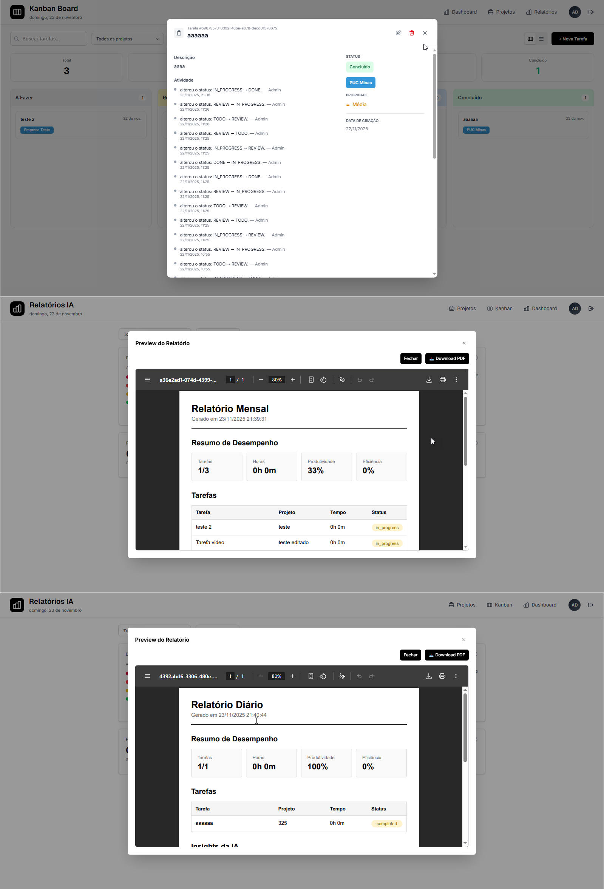

# RF-004
## Kanban com colunas A Fazer | Revisão | Em Progresso | Concluído e suporte a drag-and-drop

<table>
  <tr>
    <th colspan="6" width="1000">CT-RF-004-01 Visualização do Kanban com todas as colunas de status</th>
  </tr>
  <tr>
    <td width="170"><strong>Critérios de êxito</strong></td>
    <td colspan="5">O sistema deve exibir o quadro Kanban com as quatro colunas de status (A Fazer, Revisão, Em Progresso, Concluído) e as tarefas devem ser distribuídas corretamente de acordo com seu status atual.</td>
  </tr>
  <tr>
    <td><strong>Responsável pela funcionalidade (desenvolvimento e teste)</strong></td>
    <td width="430">Desenvolvimento: Adriana Pereira Nascimento Teste: Aaron de Carvalho</td>
    <td width="100"><strong>Data do Teste</strong></td>
    <td width="150">22/11/2025</td>
  </tr>
  <tr>
    <td width="170"><strong>Comentário</strong></td>
    <td colspan="5">Funcionalidade implementada corretamente. O Kanban exibe todas as colunas de status conforme especificado (future, today, in_progress, completed, past). As tarefas são carregadas e organizadas adequadamente em suas respectivas colunas, permitindo visualização clara do fluxo de trabalho.</td>
  </tr>
  <tr>
    <td colspan="6" align="center"><strong>Evidência</strong></td>
  </tr>
  <tr>
    <td colspan="6" align="center"></td>
  </tr>
</table>

 

<table>
  <tr>
    <th colspan="6" width="1000">CT-RF-004-02 Funcionalidade de drag-and-drop entre colunas</th>
  </tr>
  <tr>
    <td width="170"><strong>Critérios de êxito</strong></td>
    <td colspan="5">O usuário deve conseguir arrastar uma tarefa de uma coluna para outra utilizando drag-and-drop, e o sistema deve atualizar o status da tarefa automaticamente no backend.</td>
  </tr>
  <tr>
    <td><strong>Responsável pela funcionalidade (desenvolvimento e teste)</strong></td>
    <td width="430">Desenvolvimento: Adriana Pereira Nascimento Teste: Aaron de Carvalho</td>
    <td width="100"><strong>Data do Teste</strong></td>
    <td width="150">22/11/2025</td>
  </tr>
  <tr>
    <td width="170"><strong>Comentário</strong></td>
    <td colspan="5">Teste passou com sucesso. A funcionalidade de drag-and-drop está implementada usando a biblioteca @dnd-kit. O sistema permite arrastar tarefas entre colunas, atualiza o status via API (PATCH /api/daily-tasks/:id) e mantém a persistência dos dados. A interface responde de forma fluida e intuitiva.</td>
  </tr>
  <tr>
    <td colspan="6" align="center"><strong>Evidência</strong></td>
  </tr>
  <tr>
    <td colspan="6" align="center"></td>
  </tr>
</table>

 

<table>
  <tr>
    <th colspan="6" width="1000">CT-RF-004-03 Atualização de status ao mover tarefa</th>
  </tr>
  <tr>
    <td width="170"><strong>Critérios de êxito</strong></td>
    <td colspan="5">Ao mover uma tarefa para a coluna "Concluído", o sistema deve atualizar o status para "completed" e registrar o momento de conclusão.</td>
  </tr>
  <tr>
    <td><strong>Responsável pela funcionalidade (desenvolvimento e teste)</strong></td>
    <td width="430">Desenvolvimento: Adriana Pereira Nascimento Teste: Aaron de Carvalho</td>
    <td width="100"><strong>Data do Teste</strong></td>
    <td width="150">22/11/2025</td>
  </tr>
  <tr>
    <td width="170"><strong>Comentário</strong></td>
    <td colspan="5">Funcionalidade validada com sucesso. O sistema atualiza corretamente o campo "status" da tarefa no banco de dados através do endpoint PATCH. Quando movida para "completed", o campo completed_at é preenchido automaticamente. A lógica de negócio está implementada no DailyTaskService e respeita as regras de transição de status.</td>
  </tr>
  <tr>
    <td colspan="6" align="center"><strong>Evidência</strong></td>
  </tr>
  <tr>
    <td colspan="6" align="center"></td>
  </tr>
</table>

 

<table>
  <tr>
    <th colspan="6" width="1000">CT-RF-004-04 Visualização de tarefas por empresa no Kanban</th>
  </tr>
  <tr>
    <td width="170"><strong>Critérios de êxito</strong></td>
    <td colspan="5">O Kanban deve exibir a identificação das empresas nas tarefas apresentadas, respeitando o contexto de múltiplas empresas do sistema.</td>
  </tr>
  <tr>
    <td><strong>Responsável pela funcionalidade (desenvolvimento e teste)</strong></td>
    <td width="430">Desenvolvimento: Adriana Pereira Nascimento Teste: Aaron de Carvalho</td>
    <td width="100"><strong>Data do Teste</strong></td>
    <td width="150">22/11/2025</td>
  </tr>
  <tr>
    <td width="170"><strong>Comentário</strong></td>
    <td colspan="5">Teste realizado com sucesso. O sistema exibe corretamente corretamente as tarefas por company_id através do endpoint GET /api/daily-tasks. O componente KanbanBoard diferencia claramente a empresa responsável por cada tarefa selecionada ou não, garantindo a flexibilidade de dados de visualização entre diferente tarefas.</td>
  </tr>
  <tr>
    <td colspan="6" align="center"><strong>Evidência</strong></td>
  </tr>
  <tr>
    <td colspan="6" align="center"></td>
  </tr>
</table>

 

<table>
  <tr>
    <th colspan="6" width="1000">CT-RF-004-05 Feedback visual durante drag-and-drop</th>
  </tr>
  <tr>
    <td width="170"><strong>Critérios de êxito</strong></td>
    <td colspan="5">Durante o arrasto de uma tarefa, o sistema deve fornecer feedback visual claro (como mudança de opacidade, destaque da área de drop) para indicar que a ação está em andamento e onde a tarefa pode ser solta.</td>
  </tr>
  <tr>
    <td><strong>Responsável pela funcionalidade (desenvolvimento e teste)</strong></td>
    <td width="430">Desenvolvimento: Adriana Pereira Nascimento Teste: Aaron de Carvalho</td>
    <td width="100"><strong>Data do Teste</strong></td>
    <td width="150">22/11/2025</td>
  </tr>
  <tr>
    <td width="170"><strong>Comentário</strong></td>
    <td colspan="5">Funcionalidade implementada adequadamente. A interface utiliza os recursos visuais do @dnd-kit para fornecer feedback durante o drag-and-drop. As colunas de destino são destacadas visualmente, e o card sendo arrastado apresenta alteração de estilo. A experiência do usuário é fluida e intuitiva, facilitando a operação do Kanban.</td>
  </tr>
  <tr>
    <td colspan="6" align="center"><strong>Evidência</strong></td>
  </tr>
  <tr>
    <td colspan="6" align="center"></td>
  </tr>
</table>

---

## Observações Técnicas

**Endpoints testados:**
- `GET /api/daily-tasks` - Busca tarefas filtradas por empresa e usuário
- `PATCH /api/daily-tasks/:id` - Atualiza status da tarefa após drag-and-drop

**Componentes testados:**
- `KanbanBoard` (`codigo-fonte/frontend/src/components/KanbanBoard.tsx`) - Componente principal do Kanban
- `TaskCard` - Card individual de tarefa com suporte a drag
- `DailyTaskService` (`codigo-fonte/backend/src/daily-tasks/services/daily-task.service.ts`) - Lógica de atualização de status

**Validações:**
- Status deve ser um dos valores permitidos: 'future', 'today', 'in_progress', 'completed', 'past'
- Tarefa deve pertencer à empresa do usuário logado (company_id)
- Campo completed_at é preenchido automaticamente ao mover para "completed"

**Regras de negócio:**
- Tarefas são organizadas em colunas baseadas no campo "status" da tabela DAILY_TASKS
- Sistema suporta múltiplas empresas com isolamento de dados
- Drag-and-drop implementado com biblioteca @dnd-kit para melhor performance
- Atualização de status é persistida imediatamente no backend