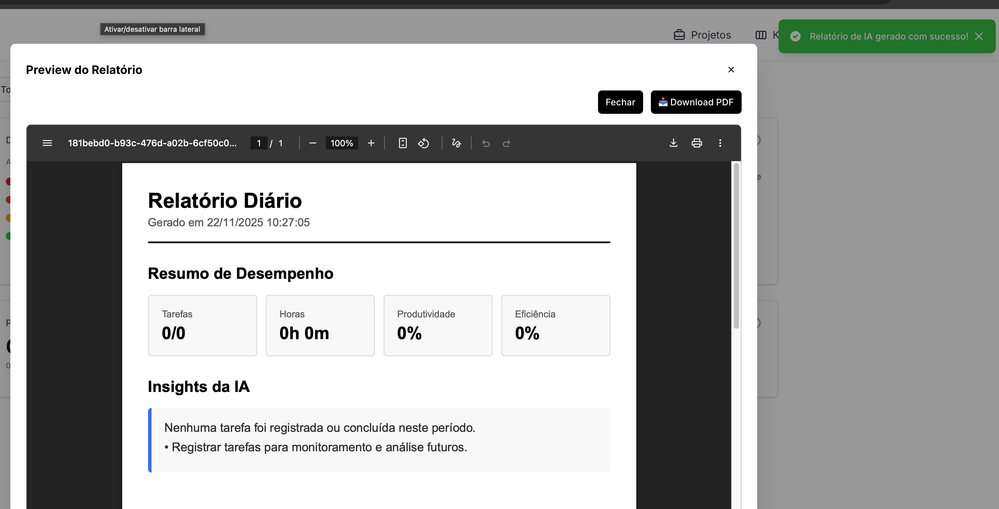
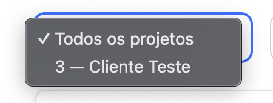
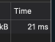

# RF-005

## Assistente IA: gerar resumos profissionais das tarefas concluídas no período

<table>
  <tr>
    <th colspan="6" width="1000">CT-RF-00501 Geração de Relatório de IA com Período Diário</th>
  </tr>
  <tr>
    <td width="170"><strong>Critérios de êxito</strong></td>
    <td colspan="5">O sistema deve gerar um relatório profissional contendo resumo das tarefas concluídas no período diário, utilizando a API Gemini para análise automatizada. O relatório deve incluir título, métricas de produtividade, insights da IA e distribuição de prioridades.</td>
  </tr>
  <tr>
    <td><strong>Responsável pela funcionalidade (desenvolvimento e teste)</strong></td>
    <td width="430">Desenvolvimento: William da Silva Rodrigues Teste: Enzo Gomes Azevedo</td>
    <td width="100"><strong>Data do Teste</strong></td>
    <td width="150">14/11/2025</td>
  </tr>
  <tr>
    <td width="170"><strong>Comentário</strong></td>
    <td colspan="5">Funcionalidade implementada corretamente. O sistema integra com a API Gemini, processa os dados de tarefas do período selecionado e retorna um relatório estruturado com análise profissional. A interface exibe botão de geração e modal com preview do PDF gerado.</td>
  </tr>
  <tr>
    <td colspan="6" align="center"><strong>Evidência</strong></td>
  </tr>
  <tr>
    <td colspan="6" align="center"></td>
  </tr>
</table>

 

<table>
  <tr>
    <th colspan="6" width="1000">CT-RF-00502 Geração de Relatório de IA com Escopo de Projeto Específico</th>
  </tr>
  <tr>
    <td width="170"><strong>Critérios de êxito</strong></td>
    <td colspan="5">O sistema deve permitir filtrar o relatório de IA por projeto específico. Quando um projeto é selecionado, apenas as tarefas relacionadas àquele projeto devem ser incluídas na análise da IA.</td>
  </tr>
  <tr>
    <td><strong>Responsável pela funcionalidade (desenvolvimento e teste)</strong></td>
    <td width="430">Desenvolvimento: William da Silva Rodrigues Teste: Enzo Gomes Azevedo</td>
    <td width="100"><strong>Data do Teste</strong></td>
    <td width="150">14/11/2025</td>
  </tr>
  <tr>
    <td width="170"><strong>Comentário</strong></td>
    <td colspan="5">Teste passou com sucesso. A funcionalidade de escopo (scope: 'all' ou 'project') está implementada corretamente. O sistema valida o projectId quando o escopo é 'project' e filtra adequadamente as tarefas antes de enviar para a análise da IA.</td>
  </tr>
  <tr>
    <td colspan="6" align="center"><strong>Evidência</strong></td>
  </tr>
  <tr>
    <td colspan="6" align="center"></td>
  </tr>
</table>

 

 

<table>
  <tr>
    <th colspan="6" width="1000">CT-RF-00503 Cache e Otimização de Relatórios Duplicados</th>
  </tr>
  <tr>
    <td width="170"><strong>Critérios de êxito</strong></td>
    <td colspan="5">O sistema deve evitar gerar relatórios duplicados para o mesmo escopo/período/projeto. Quando um relatório já existe (identificado por reportKey), deve retornar os dados armazenados sem reprocessar via API Gemini.</td>
  </tr>
  <tr>
    <td><strong>Responsável pela funcionalidade (desenvolvimento e teste)</strong></td>
    <td width="430">Desenvolvimento: William da Silva Rodrigues Teste: Enzo Gomes Azevedo</td>
    <td width="100"><strong>Data do Teste</strong></td>
    <td width="150">14/11/2025</td>
  </tr>
  <tr>
    <td width="170"><strong>Comentário</strong></td>
    <td colspan="5">Funcionalidade de cache implementada corretamente. O sistema gera um hash SHA256 baseado em escopo, projectId e intervalo de datas para criar chave única (reportKey). Antes de chamar a API Gemini, verifica se já existe relatório com a mesma chave no banco de dados, otimizando custos e performance.</td>
  </tr>
  <tr>
    <td colspan="6" align="center"><strong>Evidência</strong></td>
  </tr>
  <tr>
    <td colspan="6" align="center"></td>
  </tr>
</table>

 

<table>
  <tr>
    <th colspan="6" width="1000">CT-RF-00504 Exportação do Relatório de IA em PDF</th>
  </tr>
  <tr>
    <td width="170"><strong>Critérios de êxito</strong></td>
    <td colspan="5">O sistema deve permitir visualização do relatório de IA em formato PDF no navegador e download do arquivo. O PDF deve conter as informações geradas pela IA formatadas profissionalmente.</td>
  </tr>
  <tr>
    <td><strong>Responsável pela funcionalidade (desenvolvimento e teste)</strong></td>
    <td width="430">Desenvolvimento: William da Silva Rodrigues Teste: Enzo Gomes Azevedo</td>
    <td width="100"><strong>Data do Teste</strong></td>
    <td width="150">14/11/2025</td>
  </tr>
  <tr>
    <td width="170"><strong>Comentário</strong></td>
    <td colspan="5">Teste passou com sucesso. O frontend utiliza @react-pdf/renderer para gerar e visualizar PDF. O componente ReportPDFDocument renderiza os dados da IA em layout profissional. O modal permite preview em PDFViewer e download via blob com nomenclatura padronizada (ex: daily-report-2025-01-15.pdf).</td>
  </tr>
  <tr>
    <td colspan="6" align="center"><strong>Evidência</strong></td>
  </tr>
  <tr>
    <td colspan="6" align="center"></td>
  </tr>
</table>

---

## Observações Técnicas

**Endpoints testados:**

- `POST /api/reports/ai` ([reports.controller.ts:18](codigo-fonte/backend/src/reports/reports.controller.ts#L18)) - Geração de relatório de IA com autenticação JWT e validação de role ADMIN

**Componentes testados:**

- `ReportsPage` ([ReportsPage.jsx:66-85](codigo-fonte/frontend/src/pages/ReportsPage.jsx#L66-L85)) - Interface principal com filtros de período/projeto e botão de geração
- `aiReportsService.generate` ([aiReportsService.js:4-16](codigo-fonte/frontend/src/services/aiReportsService.js#L4-L16)) - Service layer para comunicação com API
- `GeminiService.jsonFromFacts` ([gemini.service.ts:22-84](codigo-fonte/backend/src/ia/gemini.service.ts#L22-L84)) - Integração com API Gemini para análise
- `ReportsService.generate` ([reports.service.ts:29-99](codigo-fonte/backend/src/reports/reports.service.ts#L29-L99)) - Lógica de negócio, cache e agregação de dados
- `ReportPDFDocument` - Renderização de PDF com layout profissional

**Validações:**

- Autenticação via JWT obrigatória no endpoint
- Role 'ADMIN' obrigatório via @Roles decorator e RolesGuard
- Validação de enum Scope ('all' | 'project') via class-validator
- Validação de enum Period ('daily' | 'weekly' | 'monthly')
- projectId obrigatório quando scope = 'project'
- Tratamento de resposta JSON inválida da API Gemini com fallbacks
- Validação de existência de relatório via reportKey antes de reprocessar

**Regras de negócio:**

- Relatórios são cacheados por hash SHA256 de escopo+projectId+período
- Apenas tarefas criadas, iniciadas ou concluídas no período são incluídas
- Agregação automática de métricas por status e prioridade
- Suporte a 3 períodos: daily (dia atual), weekly (semana atual, segunda=início), monthly (mês atual)
- Limite de 500 tarefas enviadas para análise da IA (performance)
- Modelo Gemini configurável via GEMINI_OPTS (padrão: gemini-2.5-flash, temperature ajustável)
- System prompt configurável via variável AI_REPORT_PROMPT ou prompt padrão
- Geração de PDF via Playwright/Chromium no backend (método generatePdf) ou @react-pdf/renderer no frontend
- Armazenamento de aiData como JSON no banco (campo aiData da tabela reports)
