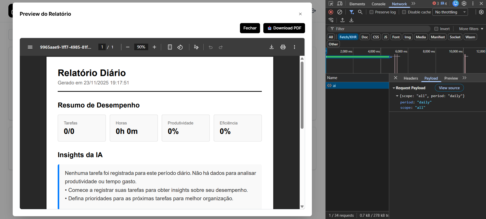
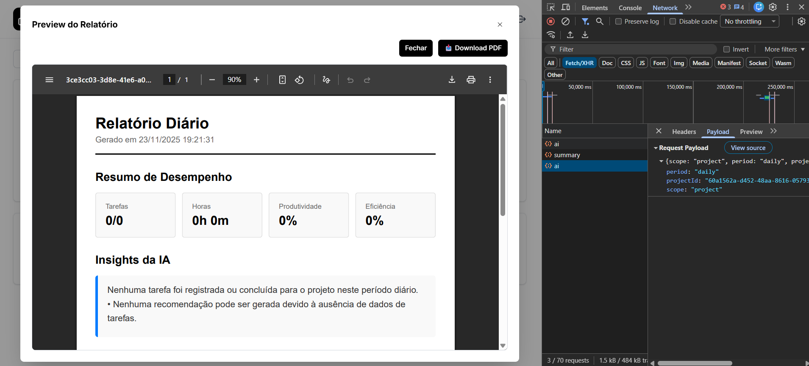
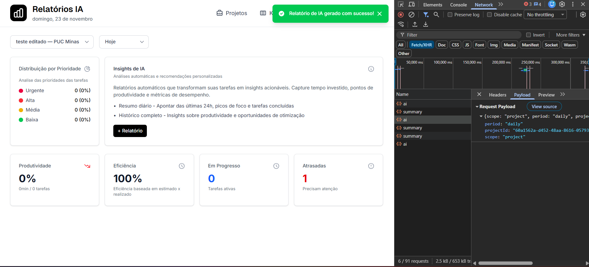
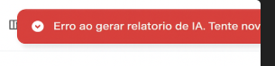

# RF-006

## Geração de relatórios por projeto/label (período selecionado)

<table>
  <tr>
    <th colspan="6" width="1000">CT-RF-00601 Resumo de métricas para todos os projetos (período selecionado)</th>
  </tr>
  <tr>
    <td width="170"><strong>Critérios de êxito</strong></td>
    <td colspan="5">
      Ao acessar a página de relatórios, selecionar um período (por exemplo, &quot;Hoje&quot;) e
      manter a seleção de projeto em branco (&quot;todos&quot;), deve ser disparada a chamada
      <code>POST /dashboard/summary</code> via <code>dashboardsService.summary</code> com
      <code>scope = 'all'</code> e o período correspondente (<code>daily</code>, <code>weekly</code>
      ou <code>monthly</code>). As métricas de resumo devem ser exibidas na tela (cards, gráficos ou
      listagens) de forma coerente com o retorno da API.
    </td>
  </tr>
  <tr>
    <td><strong>Responsável pela funcionalidade (desenvolvimento e teste)</strong></td>
    <td width="430">
      Desenvolvimento: Aaron Carvalho Balbino 
      Teste: William da Silva Rodrigues
    </td>
    <td width="100"><strong>Data do Teste</strong></td>
    <td width="150">10/11/2025</td>
  </tr>
  <tr>
    <td width="170"><strong>Comentário</strong></td>
    <td colspan="5">
      Teste garante o comportamento padrão da <code>ReportsPage</code> quando nenhum projeto é
      filtrado. Espera-se que o mapeamento de rótulos da UI (<em>PERIOD_OPT</em>) para os valores
      enviados à API (<code>daily/weekly/monthly</code>) esteja correto e que as métricas apareçam
      sem erros no console. Comentário final deve indicar se o resumo global foi carregado sem
      inconsistências.
    </td>
  </tr>
  <tr>
    <td colspan="6" align="center"><strong>Evidência</strong></td>
  </tr>
  <tr>
    <td colspan="6" align="center"></td>
  </tr>
</table>

 

<table>
  <tr>
    <th colspan="6" width="1000">CT-RF-00602 Resumo de métricas filtrado por projeto específico</th>
  </tr>
  <tr>
    <td width="170"><strong>Critérios de êxito</strong></td>
    <td colspan="5">
      Ao selecionar um projeto específico no filtro da página de relatórios e escolher um período,
      a chamada <code>POST /dashboard/summary</code> deve ser feita com
      <code>scope = 'project'</code>, incluindo <code>projectId</code> e <code>period</code> no
      corpo. Os dados de resumo exibidos devem considerar apenas o projeto selecionado (por exemplo,
      tarefas, horas ou métricas relacionadas somente àquele projeto).
    </td>
  </tr>
  <tr>
    <td><strong>Responsável pela funcionalidade (desenvolvimento e teste)</strong></td>
    <td width="430">
      Desenvolvimento: Aaron Carvalho Balbino 
      Teste: William da Silva Rodrigues
    </td>
    <td width="100"><strong>Data do Teste</strong></td>
    <td width="150">10/11/2025</td>
  </tr>
  <tr>
    <td width="170"><strong>Comentário</strong></td>
    <td colspan="5">
      Teste foca na correta propagação de <code>selectedProjectId</code> para o
      <code>dashboardsService.summary</code> e na diferença visível entre resumo global e por
      projeto. O comentário deve indicar se houve alteração consistente dos dados ao alternar entre
      &quot;Todos&quot; e um projeto específico e se a UI permaneceu estável durante a troca.
    </td>
  </tr>
  <tr>
    <td colspan="6" align="center"><strong>Evidência</strong></td>
  </tr>
  <tr>
    <td colspan="6" align="center"></td>
  </tr>
</table>

 

<table>
  <tr>
    <th colspan="6" width="1000">CT-RF-00603 Geração de relatório de IA para período e projeto selecionados</th>
  </tr>
  <tr>
    <td width="170"><strong>Critérios de êxito</strong></td>
    <td colspan="5">
      Ao clicar no botão de &quot;+ Relatório&quot; (disponível apenas para usuários com papel
      <code>ADMIN</code>) na página de relatórios, deve ser chamada a API
      <code>POST /reports/ai</code> via <code>aiReportsService.generate</code>, com
      <code>scope</code> definido a partir do projeto selecionado e <code>period</code> conforme o
      filtro. Em caso de sucesso, o dado retornado (<code>data</code> do relatório) deve ser
      armazenado em estado (<code>reportData</code>), o modal de visualização deve ser aberto e a
      mensagem &quot;Relatório de IA gerado com sucesso!&quot; deve ser exibida.
    </td>
  </tr>
  <tr>
    <td><strong>Responsável pela funcionalidade (desenvolvimento e teste)</strong></td>
    <td width="430">
      Desenvolvimento: Aaron Carvalho Balbino 
      Teste: William da Silva Rodrigues
    </td>
    <td width="100"><strong>Data do Teste</strong></td>
    <td width="150">10/11/2025</td>
  </tr>
  <tr>
    <td width="170"><strong>Comentário</strong></td>
    <td colspan="5">
      Teste voltado à integração entre filtros de período/projeto e o serviço de IA. Deve ser
      observado se o botão respeita a condição
      <code>disabled={isGenerating || user.role !== 'ADMIN'}</code> e se o modal com
      <code>ReportPDFDocument</code> ou visualização similar é aberto com os dados retornados.
      Comentário final deve registrar se a experiência foi fluida e sem erros aparentes.
    </td>
  </tr>
  <tr>
    <td colspan="6" align="center"><strong>Evidência</strong></td>
  </tr>
  <tr>
    <td colspan="6" align="center"></td>
  </tr>
</table>

 

<table>
  <tr>
    <th colspan="6" width="1000">CT-RF-00604 Tratamento de erro ao gerar relatório de IA</th>
  </tr>
  <tr>
    <td width="170"><strong>Critérios de êxito</strong></td>
    <td colspan="5">
      Diante de falha na chamada <code>POST /reports/ai</code> (por exemplo, erro 500 ou falha de
      rede simulada), a página deve exibir a mensagem de erro
      &quot;Erro ao gerar relatório de IA. Tente novamente.&quot; e registrar o erro no console.
      O estado <code>isGenerating</code> deve ser resetado e o modal de relatório não deve ser
      aberto com dados inconsistentes.
    </td>
  </tr>
  <tr>
    <td><strong>Responsável pela funcionalidade (desenvolvimento e teste)</strong></td>
    <td width="430">
      Desenvolvimento: Aaron Carvalho Balbino 
      Teste: William da Silva Rodrigues
    </td>
    <td width="100"><strong>Data do Teste</strong></td>
    <td width="150">10/11/2025</td>
  </tr>
  <tr>
    <td width="170"><strong>Comentário</strong></td>
    <td colspan="5">
      Teste de robustez da integração de IA. Deve validar se o toast de erro aparece, se o botão
      volta ao estado clicável após a falha e se nenhum dado parcial ou quebrado é apresentado ao
      usuário. Comentário final deve indicar se o fluxo de erro está adequado para uso em produção.
    </td>
  </tr>
  <tr>
    <td colspan="6" align="center"><strong>Evidência</strong></td>
  </tr>
  <tr>
    <td colspan="6" align="center"></td>
  </tr>
</table>

---

## Observações Técnicas

**Endpoints testados:**

- `POST /dashboard/summary` – Resumo de métricas por período e escopo (all/projeto).
- `POST /reports/ai` – Geração de relatório textual via IA para o período/projeto definidos.

**Componentes testados:**

- `ReportsPage` (`codigo-fonte/frontend/src/pages/ReportsPage.jsx`) – Página de filtros e visualização de relatórios.
- `ReportPDFDocument` (`codigo-fonte/frontend/src/components/reports/ReportPDFDocument.jsx`) – Template de PDF.
- `ReportTemplate` (`codigo-fonte/frontend/src/components/reports/ReportTemplate.jsx`) – Estrutura visual do relatório.
- `dashboardService` (`codigo-fonte/frontend/src/services/dashboardService.js`) – Integração com `/dashboard/summary`.
- `aiReportsService` (`codigo-fonte/frontend/src/services/aiReportsService.js`) – Integração com `/reports/ai`.
- `projectsService` (`codigo-fonte/frontend/src/services/projectsService.js`) – Listagem de projetos para o filtro.

**Validações:**

- Mapeamento de rótulos de período (`PERIOD_OPT`) para valores enviados à API (`daily`, `weekly`, `monthly`).
- Definição de `scope = 'all'` quando não há `selectedProjectId`, e `scope = 'project'` quando há.
- Habilitação do botão de IA apenas para usuários com `user.role === 'ADMIN'`.
- Controle de estado `isGenerating` para evitar chamadas duplicadas.

**Regras de negócio:**

- Relatórios devem ser sempre gerados a partir de um período discreto (dia/semana/mês).
- Quando um projeto é selecionado, o resumo e os relatórios consideram somente os dados daquele projeto.
- O relatório de IA consome o mesmo escopo (all/projeto) e período da página para consistência analítica.
