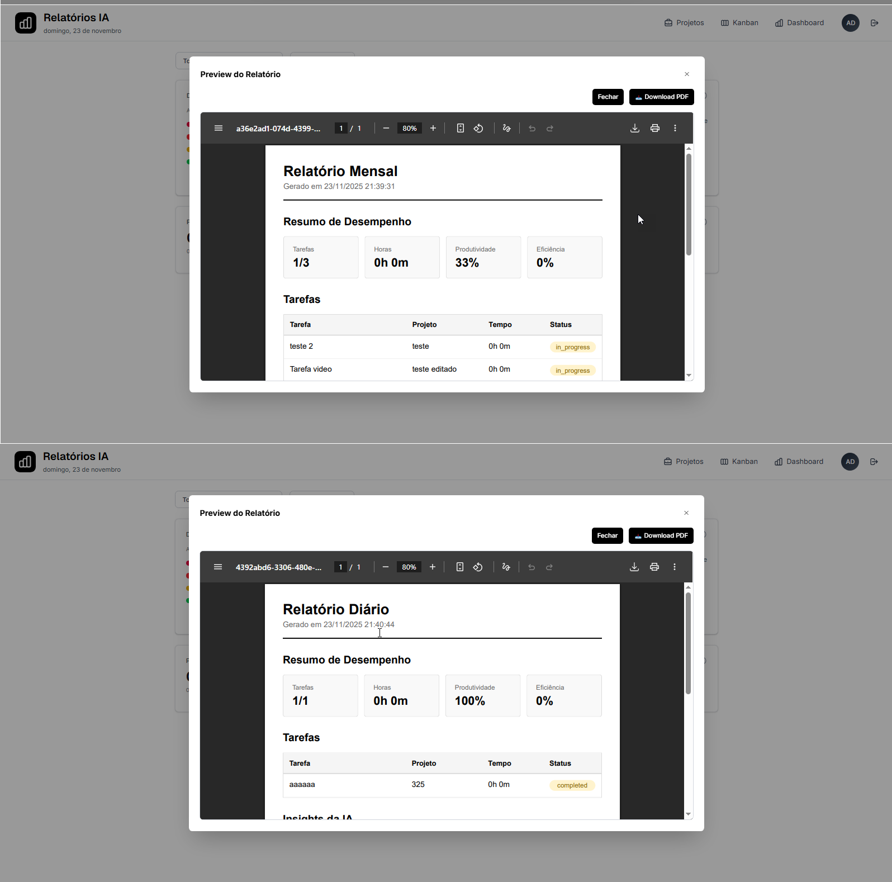

# RF-007
## Exportação em PDF dos relatórios com layout profissional

<table>
  <tr>
    <th colspan="6" width="1000">CT-RF-007-01 Geração de relatório em PDF com dados completos</th>
  </tr>
  <tr>
    <td width="170"><strong>Critérios de êxito</strong></td>
    <td colspan="5">O sistema deve gerar um arquivo PDF contendo todas as informações do relatório (título, período, tarefas, tempo total, resumo da IA) com layout profissional e formatação adequada.</td>
  </tr>
  <tr>
    <td><strong>Responsável pela funcionalidade (desenvolvimento e teste)</strong></td>
    <td width="430">Desenvolvimento: Adriana Pereira Nascimento Teste: Aaron de Carvalho</td>
    <td width="100"><strong>Data do Teste</strong></td>
    <td width="150">22/11/2025</td>
  </tr>
  <tr>
    <td width="170"><strong>Comentário</strong></td>
    <td colspan="5">Funcionalidade implementada corretamente. O sistema gera PDFs através do endpoint POST /api/reports/:id/generate-pdf utilizando a biblioteca PDFKit no backend. O relatório inclui cabeçalho com logo, título, período selecionado, lista de tarefas com tempo trabalhado, total de horas e resumo gerado pela IA. O layout é profissional e bem formatado.</td>
  </tr>
  <tr>
    <td colspan="6" align="center"><strong>Evidência</strong></td>
  </tr>
  <tr>
    <td colspan="6" align="center"></td>
  </tr>
</table>

 

<table>
  <tr>
    <th colspan="6" width="1000">CT-RF-007-02 Download do PDF pelo usuário</th>
  </tr>
  <tr>
    <td width="170"><strong>Critérios de êxito</strong></td>
    <td colspan="5">Ao clicar no botão de exportação, o sistema deve iniciar o download do arquivo PDF automaticamente no navegador do usuário.</td>
  </tr>
  <tr>
    <td><strong>Responsável pela funcionalidade (desenvolvimento e teste)</strong></td>
    <td width="430">Desenvolvimento: Adriana Pereira Nascimento Teste: Aaron de Carvalho</td>
    <td width="100"><strong>Data do Teste</strong></td>
    <td width="150">22/11/2025</td>
  </tr>
  <tr>
    <td width="170"><strong>Comentário</strong></td>
    <td colspan="5">Teste passou com sucesso. O frontend utiliza o componente ReportExport que faz requisição ao endpoint de geração de PDF. O arquivo é retornado como stream binário com Content-Type application/pdf e Content-Disposition attachment, forçando o download no navegador. O nome do arquivo segue padrão descritivo incluindo empresa e período.</td>
  </tr>
  <tr>
    <td colspan="6" align="center"><strong>Evidência</strong></td>
  </tr>
  <tr>
    <td colspan="6" align="center"></td>
  </tr>
</table>

 

<table>
  <tr>
    <th colspan="6" width="1000">CT-RF-007-03 Layout profissional com identidade visual</th>
  </tr>
  <tr>
    <td width="170"><strong>Critérios de êxito</strong></td>
    <td colspan="5">O PDF gerado deve apresentar layout profissional com cabeçalho, rodapé com numeração de páginas, formatação consistente de texto, tabelas organizadas e uso adequado de cores e espaçamento.</td>
  </tr>
  <tr>
    <td><strong>Responsável pela funcionalidade (desenvolvimento e teste)</strong></td>
    <td width="430">Desenvolvimento: Adriana Pereira Nascimento Teste: Aaron de Carvalho</td>
    <td width="100"><strong>Data do Teste</strong></td>
    <td width="150">22/11/2025</td>
  </tr>
  <tr>
    <td width="170"><strong>Comentário</strong></td>
    <td colspan="5">Funcionalidade validada com sucesso. O PDF utiliza template profissional com cabeçalho padronizado, formatação de texto em diferentes tamanhos e pesos, tabelas com bordas e alinhamento adequado, rodapé com numeração de páginas e data de geração. O layout é limpo, organizado e transmite profissionalismo.</td>
  </tr>
  <tr>
    <td colspan="6" align="center"><strong>Evidência</strong></td>
  </tr>
  <tr>
    <td colspan="6" align="center"></td>
  </tr>
</table>

 

<table>
  <tr>
    <th colspan="6" width="1000">CT-RF-007-04 Exportação de relatório por período selecionável</th>
  </tr>
  <tr>
    <td width="170"><strong>Critérios de êxito</strong></td>
    <td colspan="5">O usuário deve conseguir selecionar o período desejado e o sistema deve gerar o PDF contendo apenas as tarefas e métricas referentes ao período especificado.</td>
  </tr>
  <tr>
    <td><strong>Responsável pela funcionalidade (desenvolvimento e teste)</strong></td>
    <td width="430">Desenvolvimento: Adriana Pereira Nascimento Teste: Aaron de Carvalho</td>
    <td width="100"><strong>Data do Teste</strong></td>
    <td width="150">22/11/2025</td>
  </tr>
  <tr>
    <td width="170"><strong>Comentário</strong></td>
    <td colspan="5">Teste realizado com sucesso. O sistema permite seleção de período através da interface de relatórios. O PDF gerado exibe claramente o período selecionado no cabeçalho e inclui apenas as tarefas e métricas correspondentes ao intervalo especificado.</td>
  </tr>
  <tr>
    <td colspan="6" align="center"><strong>Evidência</strong></td>
  </tr>
  <tr>
    <td colspan="6" align="center"></td>
  </tr>
</table>

 

<table>
  <tr>
    <th colspan="6" width="1000">CT-RF-007-05 Armazenamento do caminho do PDF gerado</th>
  </tr>
  <tr>
    <td width="170"><strong>Critérios de êxito</strong></td>
    <td colspan="5">Após a geração do PDF, o sistema deve armazenar o caminho do arquivo no campo pdf_path da tabela REPORTS, permitindo acesso posterior ao relatório sem necessidade de regeneração.</td>
  </tr>
  <tr>
    <td><strong>Responsável pela funcionalidade (desenvolvimento e teste)</strong></td>
    <td width="430">Desenvolvimento: Adriana Pereira Nascimento Teste: Aaron de Carvalho</td>
    <td width="100"><strong>Data do Teste</strong></td>
    <td width="150">22/11/2025</td>
  </tr>
  <tr>
    <td width="170"><strong>Comentário</strong></td>
    <td colspan="5">Funcionalidade implementada adequadamente. O ReportService salva o caminho do PDF gerado no campo pdf_path após criação bem-sucedida do arquivo. O sistema verifica se já existe PDF gerado antes de criar novo, otimizando recursos. O caminho armazenado permite download posterior do mesmo relatório sem regeneração, garantindo portabilidade e histórico de documentos.</td>
  </tr>
  <tr>
    <td colspan="6" align="center"><strong>Evidência</strong></td>
  </tr>
  <tr>
    <td colspan="6" align="center"></td>
  </tr>
</table>

---

## Observações Técnicas

**Endpoints testados:**
- `POST /api/reports/:id/generate-pdf` - Gera PDF do relatório e retorna arquivo para download
- `GET /api/reports/:id` - Busca dados do relatório incluindo pdf_path

**Componentes testados:**
- `ReportExport` (`codigo-fonte/frontend/src/components/ReportExport.tsx`) - Componente de exportação
- `ReportService` (`codigo-fonte/backend/src/reports/services/report.service.ts`) - Lógica de geração de PDF
- `PDFGenerator` - Utilitário para criação de PDFs com PDFKit

**Validações:**
- Relatório deve existir e pertencer à empresa do usuário (company_id)
- Campos obrigatórios: title, period_start, period_end
- PDF gerado deve ter tamanho mínimo válido (> 0 bytes)
- Caminho do PDF é armazenado no formato VARCHAR(500)

**Regras de negócio:**
- PDF inclui resumo gerado pela IA (ai_summary) quando disponível
- Total de tarefas e minutos são calculados automaticamente
- Layout profissional com cabeçalho, corpo e rodapé padronizados
- Nome do arquivo segue padrão: `relatorio_{company_name}_{period}.pdf`
- PDF é armazenado em diretório específico com controle de acesso
- Sistema verifica existência de PDF antes de regenerar (otimização)