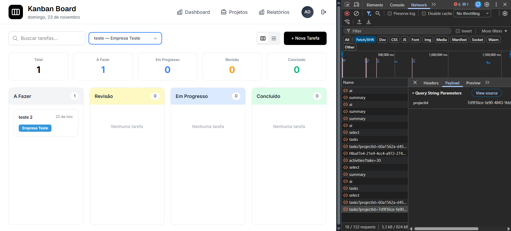
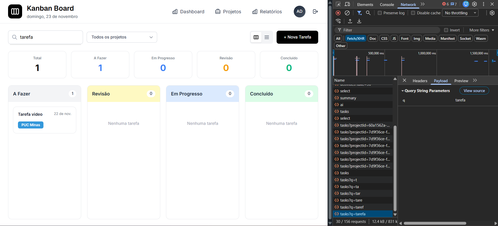

# RF-008

## Filtros/visões por projeto/label e por status

<table>
  <tr>
    <th colspan="6" width="1000">CT-RF-00801 Filtro de projeto na página de Kanban</th>
  </tr>
  <tr>
    <td width="170"><strong>Critérios de êxito</strong></td>
    <td colspan="5">
      Ao selecionar um projeto no filtro de projeto da <strong>KanbanPage</strong>, deve ser chamada
      a API <code>GET /tasks</code> via <code>tasksService.list</code> com o parâmetro
      <code>projectId</code> (apenas se o valor for diferente de &quot;all&quot;). A lista de tarefas
      exibida deve conter apenas tarefas associadas ao projeto selecionado, e os cards de estatísticas
      (quantidade por status) devem refletir apenas essas tarefas.
    </td>
  </tr>
  <tr>
    <td><strong>Responsável pela funcionalidade (desenvolvimento e teste)</strong></td>
    <td width="430">
      Desenvolvimento: Enzo Gomes Azevedo 
      Teste: William da Silva Rodrigues
    </td>
    <td width="100"><strong>Data do Teste</strong></td>
    <td width="150">10/11/2025</td>
  </tr>
  <tr>
    <td width="170"><strong>Comentário</strong></td>
    <td colspan="5">
      Teste valida se o estado <code>filters.project</code> está integrado com
      <code>tasksService.list</code> e se o backend respeita <code>projectId</code>. Comentário final
      deve registrar se as tarefas exibidas pertencem somente ao projeto escolhido e se o reset para
      &quot;Todos&quot; reverte a visão para o conjunto completo.
    </td>
  </tr>
  <tr>
    <td colspan="6" align="center"><strong>Evidência</strong></td>
  </tr>
  <tr>
    <td colspan="6" align="center"></td>
  </tr>
</table>

 

<table>
  <tr>
    <th colspan="6" width="1000">CT-RF-00803 Busca textual e limpeza de filtros na página de Kanban</th>
  </tr>
  <tr>
    <td width="170"><strong>Critérios de êxito</strong></td>
    <td colspan="5">
      Ao digitar um termo de busca no campo de pesquisa, a chamada a <code>tasksService.list</code>
      deve incluir o parâmetro <code>q</code> (quando houver texto). A listagem deve ser filtrada
      conforme o termo, podendo abranger título. Ao limpar o campo de busca e
      retornar filtros de projeto/status para &quot;Todos&quot;, a lista deve voltar a mostrar todas
      as tarefas disponíveis, sem parâmetros <code>projectId</code> e <code>status</code> na requisição.
    </td>
  </tr>
  <tr>
    <td><strong>Responsável pela funcionalidade (desenvolvimento e teste)</strong></td>
    <td width="430">
      Desenvolvimento: Enzo Gomes Azevedo 
      Teste: William da Silva Rodrigues
    </td>
    <td width="100"><strong>Data do Teste</strong></td>
    <td width="150">10/11/2025</td>
  </tr>
  <tr>
    <td width="170"><strong>Comentário</strong></td>
    <td colspan="5">
      Teste combina a busca textual (<code>filters.searchTerm</code>) com os filtros de projeto e
      status. Comentário deve apontar se o comportamento de limpar filtros de fato removeu os
      parâmetros na camada de serviço e se a visão geral voltou a exibir todos os itens esperados.
    </td>
  </tr>
  <tr>
    <td colspan="6" align="center"><strong>Evidência</strong></td>
  </tr>
  <tr>
    <td colspan="6" align="center"></td>
  </tr>
</table>

 

---

## Observações Técnicas

**Endpoints testados:**

- `GET /tasks` – Listagem de tarefas com filtros de `projectId`, e `q`.
- `POST /dashboard/summary` – Resumo filtrado por projeto/período (para visão agregada).
- `POST /reports/ai` – Relatório IA filtrado por projeto/período (visão analítica).

**Componentes testados:**

- `KanbanPage` (`codigo-fonte/frontend/src/pages/KanbanPage.jsx`) – Filtros de projeto, status e busca.
- `KanbanView` e `ListView` (`codigo-fonte/frontend/src/components/kanban/*.jsx`) – Exibição das tarefas filtradas.
- `ReportsPage` (`codigo-fonte/frontend/src/pages/ReportsPage.jsx`) – Filtros de projeto e período para relatórios.
- `tasksService` (`codigo-fonte/frontend/src/services/tasksService.js`) – Montagem dos parâmetros de filtro para `/tasks`.
- `dashboardService` (`codigo-fonte/frontend/src/services/dashboardService.js`) – Filtro de escopo/período para `/dashboard/summary`.
- `aiReportsService` (`codigo-fonte/frontend/src/services/aiReportsService.js`) – Filtro de escopo/período para `/reports/ai`.

**Validações:**

- Ignorar `projectId` quando o filtro estiver em &quot;all&quot; na chamada de `/tasks`.
- Ignorar `status` quando o filtro estiver em &quot;all&quot;, utilizando <code>STATUS_MAP</code> apenas quando um status específico é selecionado.
- Inclusão opcional do parâmetro `q` apenas quando há termo de busca.
- Definição de `scope = 'all'` ou `scope = 'project'` nos serviços de dashboard/IA conforme seleção de projeto.

**Regras de negócio:**

- A visão padrão exibe todas as tarefas (sem filtros específicos).
- Filtros aplicados devem se refletir tanto na listagem quanto nos cartões de estatística.
- Em relatórios, filtros de projeto/período devem garantir coerência entre métricas e tarefas subjacentes.
- Filtro explícito por label/tag ainda não existe como controle dedicado; atualmente, rótulos podem ser considerados indiretamente via busca textual e visualização de tags.
